# Implied Volatility Prediction across the Nifty50 options chain (PROJECT REPORT)

This README file is the __project report__ for IITR Finclub Open Projects 2026 PS-2

Implied volatility (IV) measures how much the market believes the price of a stock (or other underlying asset) will move in the future. In practice, IV is one of the most important quantities in options markets because it captures the market’s expectations of future uncertainty and typically varies across strikes, forming structures known as __volatility smiles__ or __volatility skews__.

The objective of this project is to reconstruct a partially observed implied-volatility surface. Rather than treating the task as generic missing-value problem, I approach the problem as a cross-sectional structure prediction problem. My final submission (final_submission.py) does not take into account any temporal dependencies, as I found that for this particular problem, cross-sectional structure across moneyness and IV generate high quality signals.

The remainder of this README is organized as follows. First, I present exploratory analysis of the dataset motivating the modeling decisions. Next, I describe the final methodology, including the interpolation and extrapolation procedures used for interior and edge regions of the smile, which was critical in reducing overall mse. I then present diagnostics, validation results, and finally, comparisons against alternative approaches (some of which were very promising and innovative), which unfortunately did not work for this dataset.

Before moving to the solution, the repository is centered around one file:

```bash
final_submission.py
```

That is the file I am submitting. It fills the missing implied-volatility values and writes the final submission file:

```text
submission_final.csv
```

To run it from the repository root, run the following in terminal or run the final_submission.py file:

```bash
python final_submission.py --data everything_else/cv_validation_system/dataset.csv 
```

It produces:

```text
filled_dataset_final.csv
submission_final.csv
diagnostics_final.csv
cross_section_diagnostics_final.csv
```

On the final full dataset run, the script filled `5,460` missing IV cells. I've stored the 4 generated files in the folder:
```text
submission_files
```

The rest of the directory contains submission files, eda files, validation system files that I used during the competition. All the files in the folder "everything_else" helped me make the final submission.

## Table Of Contents

- [1. Dataset Visualisation/EDA](#1-dataset-eda)
- [2. Problem Reduction](#2-final-idea)
- [3. Final IV Surfaces](#3-final-iv-surfaces)
- [4. Filling Logic](#4-filling-logic)
- [5. Progressive Edge Filling](#5-progressive-edge-filling)
- [6. Diagnostics](#6-diagnostics)
- [7. Synthetic CV Validation](#7-synthetic-cv-validation)
- [8. What I Tried](#8-what-i-tried)
- [9. Function Map](#9-function-map)
- [10. Rebuilding Figures](#10-rebuilding-figures)

## 1. Dataset EDA (Exploratory Data Analysis) / Visualisation

This section sets the motivation for all my methods and decisions presented in this report. This was my first step in the competition.

The original dataset is a __Nifty50__ options chain surface (obviously with missing values) expiring on __27th Jan 2026__. It has `975` timestamp rows, `28` option contracts (14 Put options and 14 Call options), and `5,460` missing IV (Implied Volatility) cells, which is exactly `20%` of the all the options' IVs. Furthermore, since the missing values for each option were distributed randomly across time and not in a set train/test dataset, it seemed implausible that any ML/DL model would work, but nonetheless, I tried a few ML/DL approaches (and even a CNN-based method) all of beared no fruit.

Moving ahead, the first important observation is that this is not one smooth time regime. All days from Jan 7 to Jan 23 have low, stable IV, but Jan 27 is different. Since it was the expiry day of all options, we expect the IVs to have a very fastly increasing surface, which is what we observed as shown in the picture(s) below. In the pictures below, we clearly observe a regime shift (pre 27th Jan and 27th Jan). After looking at more expiry day IV prediction research papers, and not finding anything useful, I decided to just use different hyperparameters for both regimes and that is what the current solution does as well. However, I feel there is much to be dug upon on this topic.

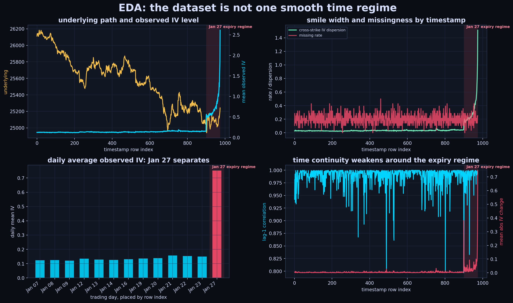

#
The missingness is also very uniformly, but randomly distributed. Each timestamp gives a partial CE (call option) smile and a partial PE (put option) smile across strikes. As you can see from the picture below (given and missing values across time and moneyness), there is no pattern to be found from the structure of missing data. Furthermore, looking at the below figure, it gives a clear direction to proceed it - to focus not too much on previous timestamps, but on the cross-sectional structure (IV smile and skew) per timestamp.

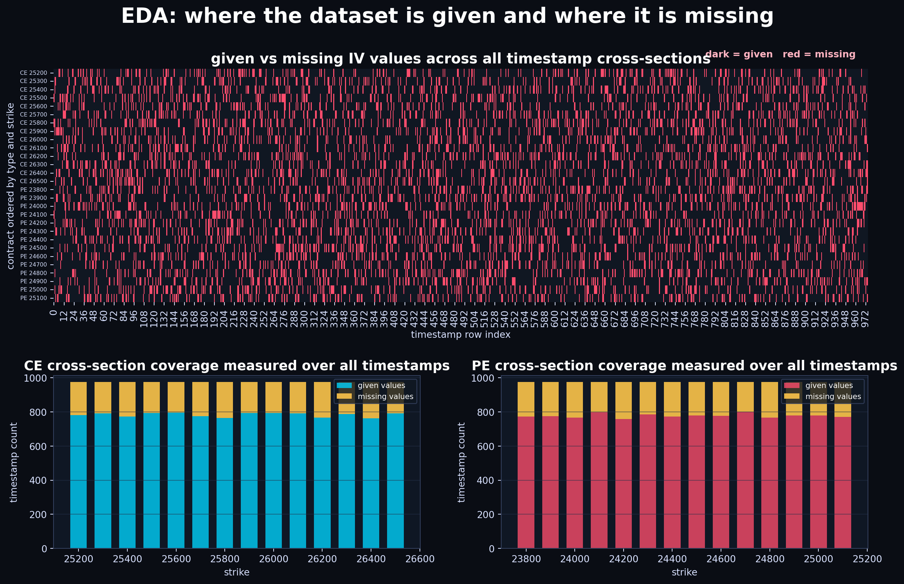

#
Further analysis of Raw smiles make the regime shift obvious by observing the scale of Y-axis in the 6 figures below. Early smiles are low and calm, while Jan 27 smiles become increasing steep and noisy (if looked at across time).

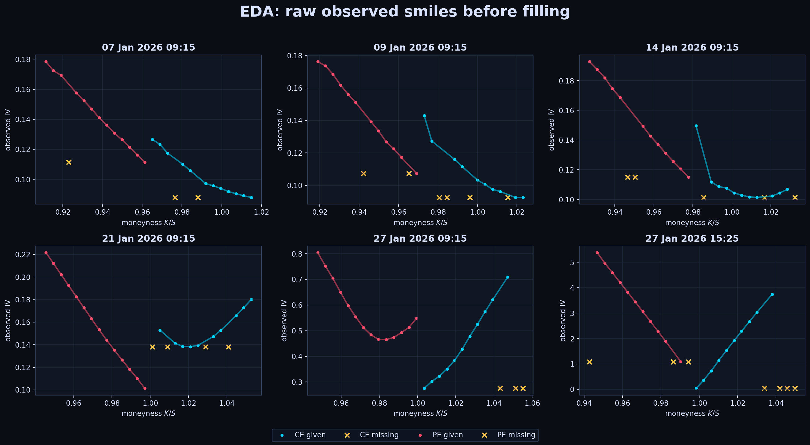

This EDA is the reason I trusted same-timestamp smile structure more than a global time-series smoother. Although the lag-1 EDA showed high adjacent-time correlation Jan 27 has much larger IV changes for the lag-1 signal to effectively capture (or atleast that's what I found).

Further EDA files can be found in the folder `everything_else/eda`


## 2. Problem reduction 

This section presents the reduction/translation of the problem statement into a geometry problem along with a key insight I realized (after 60 submissions!)

The model treats each timestamp as an implied-volatility smile, and thus solves for missing values using geometric fits. For a missing option cell, the problem reduces to:

> Fit a curve given the datapoints that represent the current underlying asset scenario. The curve should be a function of IV vs moneyness. Now, I just had to find the "best" curve.

We know, moneyness describes an option's value at a particular point in time. It relates to the option's strike price and the price of its underlying asset and indicates whether the option would make money if it were exercised immediately.

After trying various functions of strike and underlying price, I found that a simple ratio works the best. 

Thus, we define `moneyness (= x)` as:

```math
x = \frac{K}{S}
```

where `K` is strike and `S` is the underlying price.

Now, the key observation that was responsible for reducing the mse was __to classify missing values based on their relative positions across the respective option class (call/put).__

Thus, every missing cell is "routed" into one of two geometries:

```text
interior gap: the missing value was surrounded by non-missing values
edge wing: the missing value was not surrounded by non-missing values on both sides (ie: it was on an "edge")
```

Clearly, interior gaps are safer and easier to predict because there are observed strikes on both sides. However edge wings are harder and not accurate because the model has to extend the smile beyond the observed support, without regression on the other side.

## 3. Final IV Surfaces
Before moving on to the actual solution part, this section presents the results on a 3d graph of strike, time to expiry and iv. 

These surfaces are generated from the final filled dataset produced by `final_submission.py`. The small bright dots represent IV values that were already present in the original dataset. The smooth surface represents the completed IV surface after the final method inferred the missing cells.

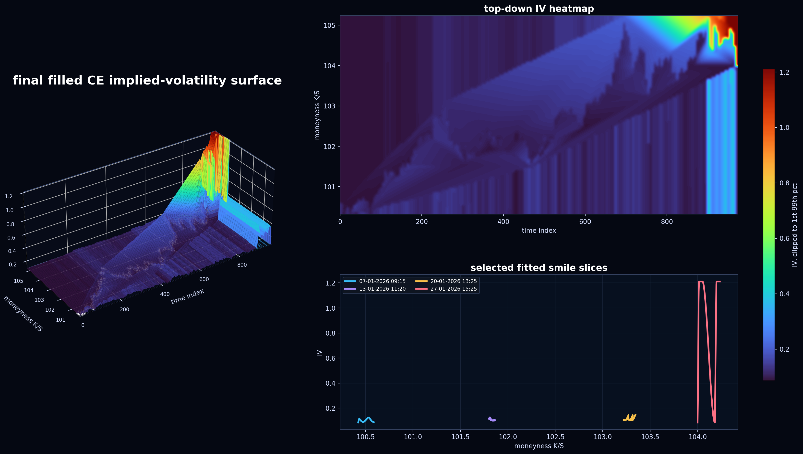

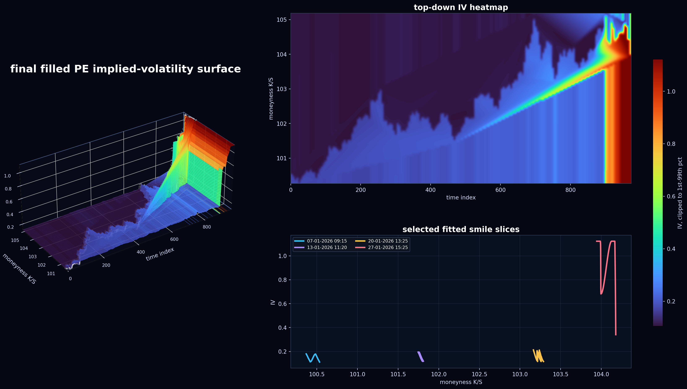


As mentioned before, the final surface is not generated by fitting one global model to all timestamps. Instead, each timestamp is treated as its own cross-sectional option smile. This matters because the IV surface is not stationary across time. The expiry-day regime, especially Jan 27, has much steeper and noisier IV behavior than the earlier dates as clearly visible from the graph(s) above.

One more thing to notics is that for each row, CE (call) values are filled using CE values from the same row, and PE (put) values are filled using PE values from the same row.  This decision was made after noting a little asymetry of the volatility smile.


## 4. Filling Logic

The distinction of classifying a missing value as `interior` and `edge` is the main structural choice in the final solution (compared to some of the earlier trials). 

Interior gaps are handled with local weighted regression plus PCHIP interpolation in an ensemble. Edge gaps are handled with progressive extrapolation and an edge ensemble of three methods that we will discuss in this section.


> We note that the late surface jump is the key visual queue that prompted me to classify missing values. As we saw, near expiry, IV rises sharply and the wings become much harder to extrapolate. This is why a single global quadratic, a single time-series smoother, or a direct machine-learning model was not enough.

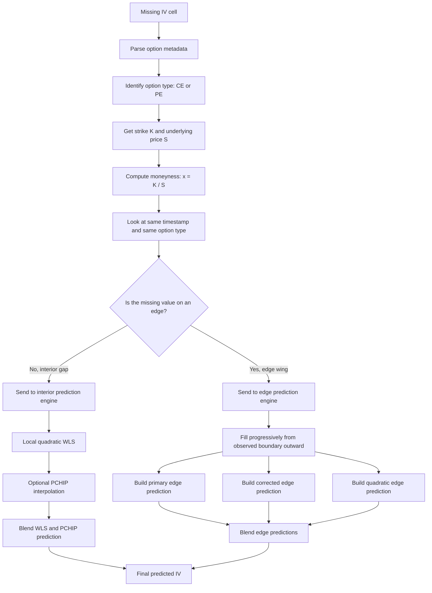
```mermaid
flowchart TD
    A[Missing IV cell] --> B[Parse option metadata]
    B --> C[Identify option type: CE or PE]
    C --> D[Get strike K and underlying price S]
    D --> E[Compute moneyness: x = K / S]
    E --> F[Look at same timestamp and same option type]
    F --> G{Is the missing value on an edge?}
    G -- No, interior gap --> H[Send to interior prediction engine]
    H --> I[Local quadratic WLS]
    I --> J[Optional PCHIP interpolation]
    J --> K[Blend WLS and PCHIP prediction]
    K --> L[Final predicted IV]
    G -- Yes, edge wing --> M[Send to edge prediction engine]
    M --> N[Fill progressively from observed boundary outward]
    N --> O[Build primary edge prediction]
    N --> P[Build corrected edge prediction]
    N --> Q[Build quadratic edge prediction]
    O --> R[Blend edge predictions]
    P --> R
    Q --> R
    R --> L
```
The full filling pipeline can be summarized as:

```text
read dataset
parse option contracts
sort by datetime
split columns into CE and PE groups
for each timestamp:
    for CE and PE separately:
        detect edge missing blocks
        detect interior missing values
        fill left edge progressively
        fill interior values
        fill right edge progressively
write filled dataset
write submission file
write diagnostics
```

The functions implementing this logic are:

```text
parse_metadata
collect_same_row_points
get_same_side_state
get_edge_blocks
is_edge_missing
predict_cell
predict_non_edge_local_poly
predict_edge_ensemble
build_missing_cell_fill_order
```

### 4.1 Metadata Parsing

The option columns have names containing:

```text
underlying
expiry
strike
option type
```

The function `parse_metadata(df)` extracts this information using the regex:

```python
r"^(?P<underlying>[A-Z]+)"
r"(?P<expiry>\d{2}[A-Z]{3}\d{2})"
r"(?P<strike>\d+)"
r"(?P<option_type>CE|PE)$"
```

For every option column, it stores:

```text
column name
underlying
expiry
strike
option type: CE or PE
expiry date
```

This creates three important maps:

```python
strike_map = dict(zip(meta["column"], meta["strike"]))
type_map   = dict(zip(meta["column"], meta["option_type"]))
cols_by_type = {
    "CE": [all CE columns],
    "PE": [all PE columns],
}
```

These maps are used everywhere in the filling logic.

The model never treats all 28 options as one unordered vector. It knows which contracts are calls, which are puts, and what strike each contract belongs to.

### 4.2 Same-Row Smile Construction

For a given row and option type, the function `collect_same_row_points` collects all observed IV values of that option type at that timestamp.

For example, if the target is a missing CE value, it collects only observed CE values from the same row.

The function returns:

```text
x_obs      = observed moneyness values
y_obs      = observed IV values
used_cols  = option columns used as training points
```

The moneyness coordinate is:

```math
x_i = \frac{K_i}{S}
```

where `K_i` is the strike of the observed option and `S` is the underlying price at the timestamp.

So the training data for one row becomes:

```math
(x_1,y_1), (x_2,y_2), \ldots, (x_n,y_n)
```

where:

```text
x_i = strike / underlying price
y_i = observed implied volatility
```

This is the cross-sectional smile used for prediction.

### 4.3 Detecting Interior Values and Edge Values

The function `get_same_side_state` builds a sorted table for one timestamp and one option type:

```text
column
strike
is_missing
iv
```

It sorts by strike. This converts the row into a one-dimensional smile layout.

For example:

```text
strike:     24000   24100   24200   24300   24400   24500
observed:   yes     yes      no      yes      no      no
```

The function `get_edge_blocks` checks missing values at the two ends.

A left-edge block looks like:

```text
missing missing observed observed observed
```

A right-edge block looks like:

```text
observed observed observed missing missing
```

The code stores fill order carefully.

For the left edge:

```python
left_fill_order = list(reversed(left_block))
```

This means the model fills the missing value closest to the observed boundary first.

For the right edge:

```python
right_fill_order = list(reversed(right_block))
```

Again, this makes the fill order go from the observed boundary outward.

The function `is_edge_missing` then decides whether a target missing cell is:

```text
left edge
right edge
all missing same side
not edge
```

If it is not an edge, it is treated as an interior value.

This classification is critical because interpolation and extrapolation are very different problems.

### 4.4 Fill Order

The function `build_missing_cell_fill_order` creates the final order in which missing values are filled.

For every row and for each option type, it orders missing values like this:

```text
left edge block, nearest boundary first
interior missing values, in strike order
right edge block, nearest boundary first
```

In code, the order is:

```python
ordered = list(left_fill) + interior + [c for c in right_fill if c not in left_fill]
```

This ensures that edge values are filled progressively. Later edge predictions can use earlier edge predictions from the same missing block.

---

## 4.5 Interior Cell Prediction

Interior cells are missing values that lie inside the observed smile support. For these, the model uses a blend of:

```text
local quadratic weighted least squares
PCHIP interpolation
```

The function responsible for this is:

```python
predict_non_edge_local_poly
```

### 4.5.1 Local Quadratic Weighted Least Squares

For target moneyness `x_0`, the model fits a local quadratic around the target:

```math
y_i
\approx
\beta_0
+
\beta_1(x_i-x_0)
+
\beta_2(x_i-x_0)^2
```

The design row for each observed point is:

```math
X_i =
\begin{bmatrix}
1 & (x_i-x_0) & (x_i-x_0)^2
\end{bmatrix}
```

The prediction at the target is:

```math
\hat{y}(x_0)=\beta_0
```

This is because at the target point:

```math
x_i-x_0=0
```

so the fitted curve becomes:

```math
\beta_0+\beta_1\cdot 0+\beta_2\cdot 0^2=\beta_0
```

The model gives more importance to nearby moneyness points using Gaussian-style weights:

```math
w_i =
\exp\left(
-\frac{(x_i-x_0)^2}{2h}
\right)
```

Here, `h` is the bandwidth. Smaller `h` means the model focuses more tightly on nearby strikes. Larger `h` makes the fit smoother and more global.

The weighted least-squares problem is:

```math
\hat{\beta}
=
\arg\min_{\beta}
\sum_i
w_i
\left(
y_i-X_i\beta
\right)^2
```

In matrix form:

```math
(X^\top W X)\hat{\beta}
=
X^\top W y
```

The code solves this using:

```python
np.linalg.solve(X.T @ WX, X.T @ (weights * y_obs))
```

If the linear system is singular, the code falls back to a weighted average:

```python
(weights @ y_obs) / weights.sum()
```

This fallback makes the method robust on small or unstable rows.

### 4.5.2 Bandwidth Selection by Leave-One-Out

The bandwidth is selected by leave-one-out cross-validation inside the same row.

The grid is:

```python
BANDWIDTH_GRID = np.array([5e-5, 7e-5, 1e-4, 1.5e-4, 2e-4])
```

For each candidate bandwidth `h`, the model temporarily removes each observed point, predicts it using the remaining points, and computes the squared error.

For one bandwidth:

```math
\mathrm{MSE}(h)
=
\frac{1}{n}
\sum_i
\left(
\hat{y}_{-i}(x_i;h)-y_i
\right)^2
```

Then the selected bandwidth is:

```math
h^\star
=
\arg\min_h
\mathrm{MSE}(h)
```

This is implemented by:

```python
select_bandwidth_by_loo
```

The actual prediction then uses:

```python
best_bw, loo_mse = select_bandwidth_by_loo(x_obs, y_obs, BANDWIDTH_GRID)
base_pred = local_poly_wls_pred(x_obs, y_obs, x_target, best_bw, degree=2)
```

So the local WLS part is not using a fixed smoothness level. It adapts per row.

### 4.5.3 PCHIP Interpolation

After the local quadratic WLS prediction, the model also computes a PCHIP prediction.

PCHIP stands for Piecewise Cubic Hermite Interpolating Polynomial.

The function is:

```python
pchip_same_row_pred
```

PCHIP is used only if:

```text
scipy is available
there are at least 4 valid observed points
the target is inside the observed moneyness range
the interpolation result is finite
```

The important safety rule is:

```python
if not (x[0] <= x_target <= x[-1]):
    return np.nan
```

So PCHIP is never used for extrapolation. It is only used for interior interpolation.

The reason for using PCHIP is that it is shape-preserving. A normal cubic spline can overshoot between points, especially when the smile has sharp bends. PCHIP is more conservative because it tries to preserve the local monotonicity and shape of the data.

Before fitting PCHIP, the code:

1. Filters non-finite values.
2. Sorts points by moneyness.
3. Collapses duplicate moneyness values by averaging their IVs.
4. Rejects the prediction if fewer than `MIN_PCHIP_POINTS = 4` unique points remain.
5. Rejects extrapolation.

The PCHIP prediction is:

```math
\hat{y}_{\mathrm{PCHIP}}(x_0)
```

The final interior prediction is a blend:

```math
\hat{y}_{\mathrm{interior}}
=
0.75\hat{y}_{\mathrm{WLS}}
+
0.25\hat{y}_{\mathrm{PCHIP}}
```

In code:

```python
pred = (1.0 - PCHIP_INTERIOR_WEIGHT) * base_pred + PCHIP_INTERIOR_WEIGHT * pchip_pred
```

with:

```python
PCHIP_INTERIOR_WEIGHT = 0.25
```

If PCHIP is unavailable or invalid, the model uses only the WLS prediction.

---

## 4.6 Edge Cell Prediction

Edge cells are the most difficult part of the problem. They are missing values at the outer wing of a CE or PE smile.

For example, a right edge can look like:

```text
observed observed observed missing_1 missing_2 missing_3
```

A left edge can look like:

```text
missing_3 missing_2 missing_1 observed observed observed
```

The model does not fill all missing edge values independently. Instead, it fills from the observed boundary outward.

For a right edge:

```text
missing_1 first
missing_2 second
missing_3 third
```

For a left edge:

```text
missing_1 first
missing_2 second
missing_3 third
```

where `missing_1` is always the missing value closest to the observed region.

This matters because once `missing_1` is predicted, it becomes context for predicting `missing_2`.

The edge prediction uses three separate components:

```text
primary
corrected
quadratic
```

The final edge prediction is:

```math
\hat{y}_{\mathrm{edge}}
=
0.72\hat{y}_{\mathrm{primary}}
+
0.14\hat{y}_{\mathrm{corrected}}
+
0.14\hat{y}_{\mathrm{quadratic}}
```

The primary model dominates. The corrected and quadratic models act as small stabilizers.

---

## 4.7 Primary Edge Predictor

The primary edge predictor is implemented by:

```python
collect_edge_training_points_primary
predict_edge_primary_local_poly
```

This is the main progressive edge model.

### 4.7.1 What Training Points It Uses

For an edge target, the function first identifies:

```text
side
block_cols
position
```

where:

```text
side       = left or right edge
block_cols = all missing columns in that edge block, ordered by fill order
position   = current missing value's index inside that edge block
```

Then it builds observed training points from the valid side of the smile.

If the target is on the right edge, only observed strikes smaller than the target strike are used:

```python
base = obs[obs["strike"] < target_strike].sort_values("strike")
```

This corresponds to:

```text
observed observed observed target
```

If the target is on the left edge, only observed strikes larger than the target strike are used:

```python
base = obs[obs["strike"] > target_strike].sort_values("strike")
```

This corresponds to:

```text
target observed observed observed
```

For each observed point, the training coordinate is:

```math
x_i = \frac{K_i}{S}
```

and:

```math
y_i = \mathrm{IV}_i
```

So the initial primary training set is:

```math
\{(K_i/S,\ IV_i)\}
```

from the observed side of the smile.

### 4.7.2 Progressive Context

The primary predictor then adds earlier predictions from the same edge block.

This part is controlled by:

```python
prev = block_cols[:int(position)] if np.isfinite(position) else []
```

So if the model is currently predicting the third missing value in an edge block, it can use the first two missing values that were already predicted.

For each previous edge prediction:

```python
pv = component_value(already_filled, pc, "primary")
```

If that previous primary prediction is finite, the code appends:

```python
x_t.append(float(pv))
y_t.append(float(pv))
used.append(f"{pc}*as_xy")
```

This is intentionally unusual. The previous prediction is inserted as both the `x` coordinate and the `y` value:

```math
x_{\mathrm{prev}} = \hat{y}_{\mathrm{prev}}
```

```math
y_{\mathrm{prev}} = \hat{y}_{\mathrm{prev}}
```

So the primary edge model uses previous edge predictions as a stabilizing progressive signal in the same numerical scale.

This is why the diagnostic label is:

```text
*as_xy
```

It means that the previous prediction was used as both the input coordinate and the output value in the primary edge component.

This is not a standard mathematical extrapolation rule. It is a heuristic preserved because it performed well in validation during the project. The practical effect is that later edge points are gently anchored by earlier edge predictions instead of being extrapolated purely from far-away observed strikes.

### 4.7.3 Primary Prediction Model

After collecting primary training points, the model calls:

```python
_edge_predict_with_deg_select
```

This helper selects both:

```text
degree d
bandwidth h
```

by leave-one-out validation.

The candidate degrees are:

```math
d \in \{1,2\}
```

The candidate bandwidths are:

```math
h
\in
\left\{
5\cdot10^{-5},
7\cdot10^{-5},
10^{-4},
1.5\cdot10^{-4},
2\cdot10^{-4}
\right\}
```

For each pair `(d,h)`, the code performs leave-one-out prediction on the edge training set:

```math
\mathrm{LOO\_MSE}(d,h)
=
\frac{1}{n}
\sum_{i=1}^{n}
\left(
\hat{y}_{-i}(x_i;d,h)-y_i
\right)^2
```

Then it selects:

```math
(d^\star,h^\star)
=
\arg\min_{d,h}
\mathrm{LOO\_MSE}(d,h)
```

The final primary prediction is:

```math
\hat{y}_{\mathrm{primary}}
=
\hat{y}(x_0;d^\star,h^\star)
```

If the selected fit fails, it falls back to:

```text
bandwidth = 2e-4
degree = 1
```

If that also fails, it falls back to the global median IV.

---

## 4.8 Corrected Edge Predictor

The corrected edge predictor is implemented by:

```python
collect_edge_training_points_corrected
predict_edge_corrected_local_poly
```

This predictor is similar to the primary predictor, but it changes how previous edge predictions are inserted.

The corrected predictor uses the actual moneyness coordinate for previous predictions.

### 4.8.1 What Training Points It Uses

Like the primary predictor, the corrected predictor first uses observed values from the valid side.

For a right edge, it uses observed strikes smaller than the target strike:

```python
if side == "right" and s < target_strike:
```

For a left edge, it uses observed strikes larger than the target strike:

```python
if side == "left" and s > target_strike:
```

Each observed point is added as:

```python
"x": strike / spot
"y": observed IV
"is_predicted": False
```

Mathematically:

```math
x_i = \frac{K_i}{S}
```

```math
y_i = \mathrm{IV}_i
```

### 4.8.2 Corrected Progressive Context

For previous predictions in the same edge block, the corrected model does this:

```python
pv = component_value(already_filled, pc, "corrected")
```

Then it appends:

```python
"x": strike_map[pc] / spot
"y": float(pv)
"is_predicted": True
```

So unlike the primary predictor, the corrected predictor uses:

```math
x_{\mathrm{prev}} = \frac{K_{\mathrm{prev}}}{S}
```

```math
y_{\mathrm{prev}} = \hat{y}_{\mathrm{prev}}
```

This is the geometrically natural version of progressive filling.

It says:

```text
The previous missing option now has a predicted IV.
Place that predicted IV at its real moneyness location.
Use it as an additional training point for the next missing edge value.
```

So if the model has:

```text
observed observed observed missing_1 missing_2
```

then after filling `missing_1`, the corrected model for `missing_2` sees:

```text
observed observed observed predicted_missing_1 target_missing_2
```

This is why it is called `corrected`: it corrects the primary model's unusual `prediction-as-x` behavior by using the actual strike-derived moneyness coordinate.

### 4.8.3 Corrected Prediction Model

Once the corrected training points are collected, prediction again uses:

```python
_edge_predict_with_deg_select
```

So corrected also selects:

```text
degree in {1,2}
bandwidth from BANDWIDTH_GRID
```

by leave-one-out MSE.

The corrected prediction is:

```math
\hat{y}_{\mathrm{corrected}}
=
\hat{y}(x_0;d^\star,h^\star)
```

This component gives the ensemble a more geometrically consistent version of the progressive edge extrapolation.

---

## 4.9 Quadratic Edge Predictor

The quadratic edge predictor is implemented by:

```python
collect_edge_training_points_quadratic
predict_edge_quadratic
```

Despite the name, in the final version this component also uses the same degree-selection helper. So it can select either degree 1 or degree 2. The name is retained because this component came from an earlier local quadratic edge strategy.

### 4.9.1 Local Wing Neighborhood

The quadratic component differs from primary and corrected in how it chooses the observed training points.

Instead of using all observed points on the valid side, it selects a local neighborhood near the edge.

The number of needed observed points is:

```python
base_n = max(MIN_EDGE_LOCAL_NEIGHBORS, len(block_cols))
```

where:

```python
MIN_EDGE_LOCAL_NEIGHBORS = 3
```

So:

```text
if the edge block has 1 or 2 missing values, use at least 3 observed neighbors
if the edge block has more missing values, use at least as many observed neighbors as the block size
```

For a right edge, it takes the nearest observed strikes to the left:

```python
base = (
    obs[obs["strike"] < target_strike]
    .sort_values("strike", ascending=False)
    .head(base_n)
    .sort_values("strike")
)
```

This means:

1. Keep only observed strikes smaller than the target.
2. Sort descending so the closest strikes come first.
3. Take `base_n` nearest observed points.
4. Sort back ascending for a clean training order.

For a left edge, it takes the nearest observed strikes to the right:

```python
base = (
    obs[obs["strike"] > target_strike]
    .sort_values("strike")
    .head(base_n)
    .sort_values("strike")
)
```

This gives a more local wing fit.

The motivation is simple:

```text
far-away strikes may not describe the wing behavior near the missing edge
```

So this component focuses only on nearby wing context.

### 4.9.2 Quadratic Progressive Context

The quadratic component also adds previous predictions from the same edge block.

For each previous missing value:

```python
pv = component_value(already_filled, pc, "quadratic")
```

it appends:

```python
"x": strike_map[pc] / spot
"y": float(pv)
"is_predicted": True
```

So the quadratic component uses actual moneyness for previous predictions, just like the corrected component.

Mathematically:

```math
x_{\mathrm{prev}} = \frac{K_{\mathrm{prev}}}{S}
```

```math
y_{\mathrm{prev}} = \hat{y}_{\mathrm{prev}}
```

The difference is that corrected uses all observed valid-side points, while quadratic uses only a local wing neighborhood.

### 4.9.3 Quadratic Prediction Model

After collecting the local wing training set, the prediction again calls:

```python
_edge_predict_with_deg_select
```

Therefore, this component also searches:

```math
d \in \{1,2\}
```

and:

```math
h
\in
\left\{
5\cdot10^{-5},
7\cdot10^{-5},
10^{-4},
1.5\cdot10^{-4},
2\cdot10^{-4}
\right\}
```

The final quadratic component prediction is:

```math
\hat{y}_{\mathrm{quadratic}}
=
\hat{y}(x_0;d^\star,h^\star)
```

The diagnostic field:

```text
edge_quadratic_fit_kind
```

stores whether the selected model behaved like:

```text
deg1_by_loo
deg2_by_loo
```

---

## 4.10 Final Edge Ensemble

The function that combines all edge predictors is:

```python
predict_edge_ensemble
```

It first computes:

```python
primary_info = predict_edge_primary_local_poly(...)
primary_pred = primary_info["prediction"]
```

Then:

```python
corrected_pred, corrected_cols, corrected_info = predict_edge_corrected_local_poly(...)
```

Then:

```python
quadratic_pred, quad_cols, quad_info, fit_kind = predict_edge_quadratic(...)
```

These produce three component predictions:

```text
primary prediction
corrected prediction
quadratic prediction
```

The code stores them as:

```python
components = {
    "primary": safe_iv(primary_pred),
    "corrected": safe_iv(corrected_pred),
    "quadratic": safe_iv(quadratic_pred),
}
```

Then it computes the final edge prediction:

```math
\hat{y}_{\mathrm{edge}}
=
0.72\hat{y}_{\mathrm{primary}}
+
0.14\hat{y}_{\mathrm{corrected}}
+
0.14\hat{y}_{\mathrm{quadratic}}
```

In code:

```python
pred = (
    EDGE_BLEND_PRIMARY * components["primary"]
    + EDGE_BLEND_CORRECTED * components["corrected"]
    + EDGE_BLEND_QUADRATIC * components["quadratic"]
)
```

where:

```python
EDGE_BLEND_PRIMARY = 0.72
EDGE_BLEND_CORRECTED = 0.14
EDGE_BLEND_QUADRATIC = 0.14
```

The reason for this design is that edge extrapolation is noisy. The primary model is the strongest component, so it receives most of the weight. The corrected and quadratic components are included with smaller weights as stabilizers. They provide alternative geometric views of the same edge problem without overpowering the main predictor.

If the ensemble prediction is not finite, the code falls back to the global median IV. In the final full run, this fallback was not needed.

---

## 4.11 How Progressive Edge Filling Works in Practice

Suppose the row has this right-edge pattern:

```text
K1        K2        K3        K4         K5
observed  observed  observed  missing_1  missing_2
```

The fill order is:

```text
missing_1 first
missing_2 second
```

For `missing_1`, the edge models use the observed side:

```text
K1, K2, K3
```

Then the model predicts:

```text
missing_1 = predicted value
```

For `missing_2`, the model can now use:

```text
K1, K2, K3, predicted_missing_1
```

So later missing values are not extrapolated from scratch. They use the previously filled values in their edge block.

This is why the script stores component predictions in:

```python
filled_values_by_row[row_idx][col] = {
    "final": pred,
    "primary": components.get("primary", pred),
    "corrected": components.get("corrected", pred),
    "quadratic": components.get("quadratic", pred),
}
```

Each component receives its own previous prediction. This avoids mixing the internal logic of the primary, corrected, and quadratic components.

For example:

```text
primary uses previous primary predictions
corrected uses previous corrected predictions
quadratic uses previous quadratic predictions
```

This keeps the progressive chain internally consistent.

---

## 4.12 Final Cell Routing Summary

The function `predict_cell` is the central router.

It first checks:

```python
edge, edge_reason, _, _, _ = is_edge_missing(...)
```

If the cell is an edge:

```python
info = predict_edge_ensemble(...)
```

If the cell is not an edge:

```python
info = predict_non_edge_local_poly(...)
```

So the final logic is:

```text
if missing cell is interior:
    use same-row local quadratic WLS
    optionally blend with PCHIP interpolation

if missing cell is edge:
    use progressive edge ensemble
    primary + corrected + quadratic
    each component selects degree and bandwidth by LOO
```

This is the final modeling structure used to generate `submission_final.csv`.4

## 5. Progressive Edge Filling

This figure shows the progressive edge idea on a real row from the final submission diagnostics. Gold crosses are still-missing edge cells. Gold diamonds are filled values. The red diamond is the newest value added at that step.

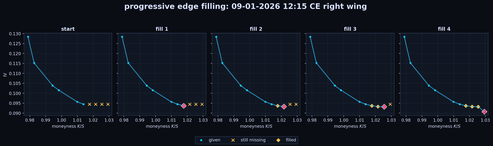

The important point is that later wing values get more local context than they would have if the method tried to extrapolate the entire block in one shot.

## 6. Diagnostics

The full final run completed every missing value without a global-median fallback.

```text
total filled cells       : 5,460
interior fills           : 4,491
edge fills               : 969
degree 2 edge selections : 812
degree 1 edge selections : 157
global median fallback   : 0
```

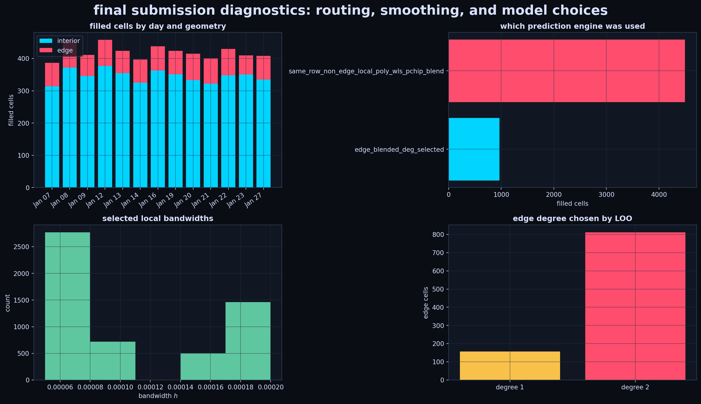

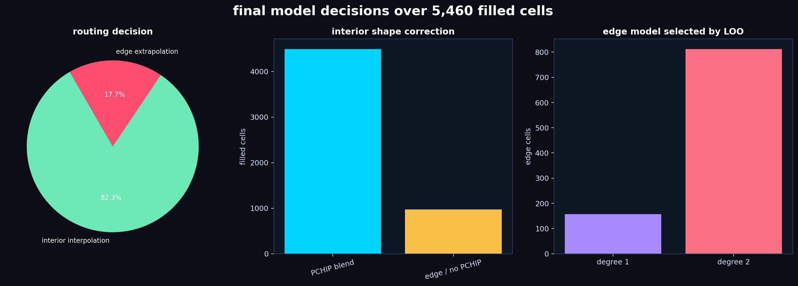

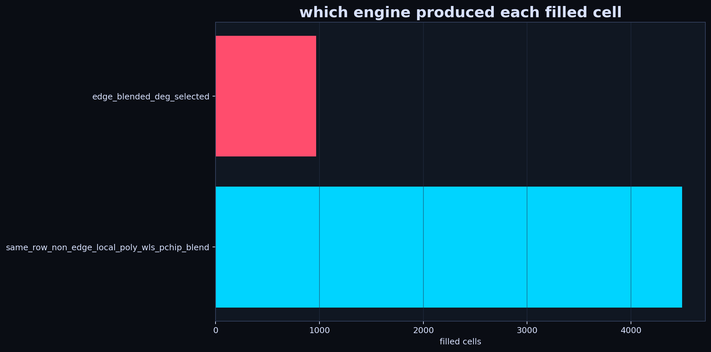

The final filled smiles below show the completed cross-sections. Yellow diamonds are cells that were originally missing and filled by the model.

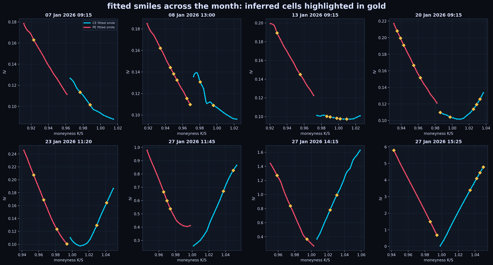

## 7. Synthetic CV Validation

The repository includes a synthetic CV system under:

```text
everything_else/cv_validation_system/
```

The validation procedure:

1. Start from observed values.
2. Hide a subset of values.
3. Run `final_submission.py` on the damaged dataset.
4. Score only the hidden cells.

I ran:

```bash
python final_submission.py \
  --data everything_else/cv_validation_system/cv_split/not_dataset.csv \
  --out-prefix readme_cv_final \
  --skip-cv
```

Then evaluated with:

```bash
python everything_else/cv_validation_system/evaluate_cv_predictions_with_heatmaps.py \
  --truth everything_else/cv_validation_system/cv_split/holdout_truth.csv \
  --pred filled_dataset_readme_cv_final.csv \
  --base everything_else/cv_validation_system/cv_split/not_dataset.csv \
  --out-dir for_generating_readme/cv_eval_final_submission \
  --top-smile-plots 12 \
  --sample-smile-plots 8
```

Overall synthetic CV results:

```text
n hidden cells scored : 2621
MSE                   : 0.0001417534
RMSE                  : 0.0119060232
MAE                   : 0.0038038407
median absolute error : 0.0005887275
bias                  : 0.0002157616
p95 absolute error    : 0.0181816275
p99 absolute error    : 0.0615417097
```

The strongest errors are concentrated near the expiry regime, which matches the EDA and the final IV surface.

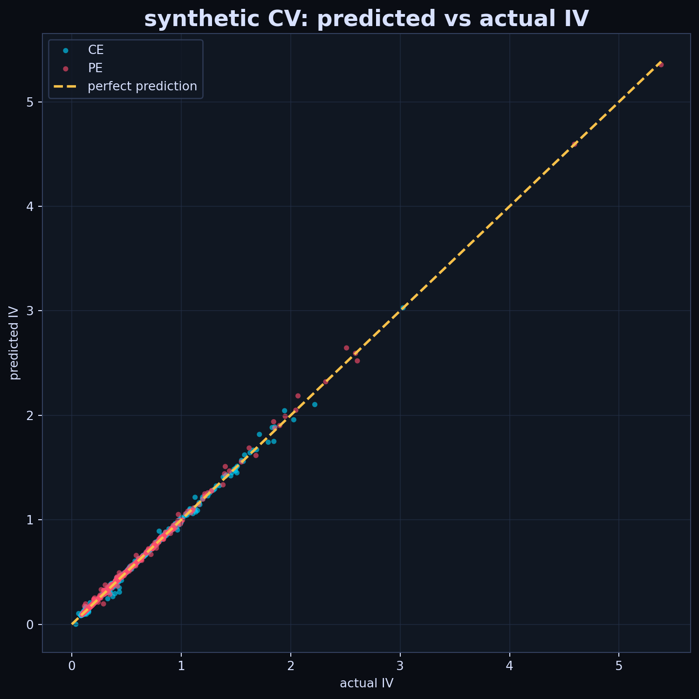

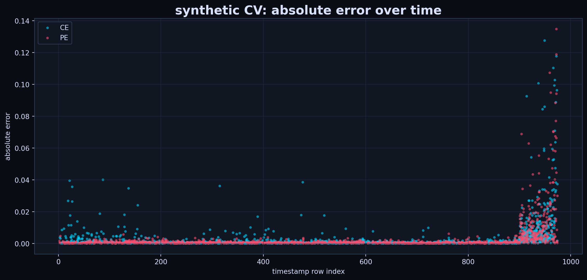

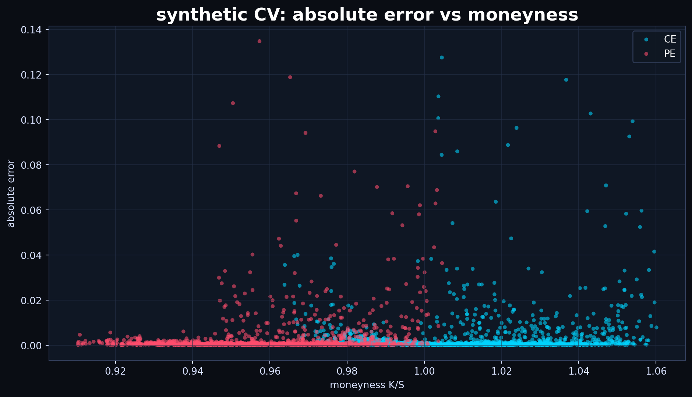

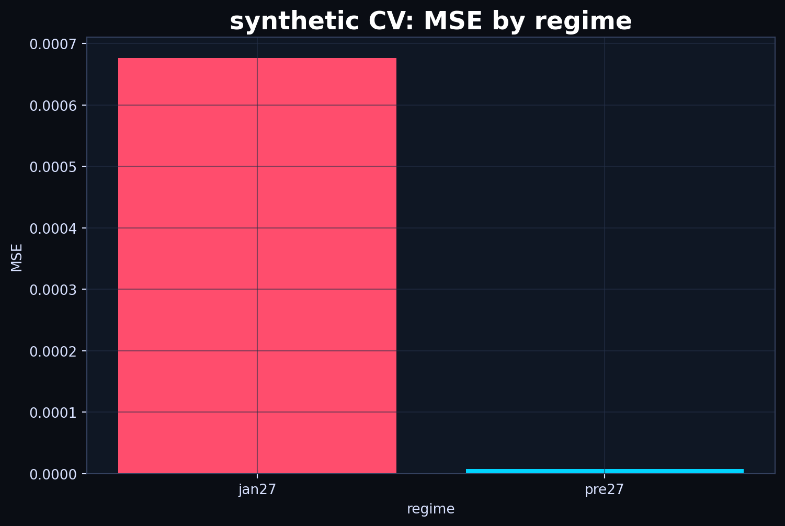

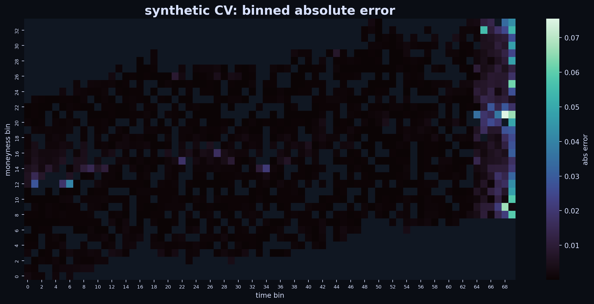

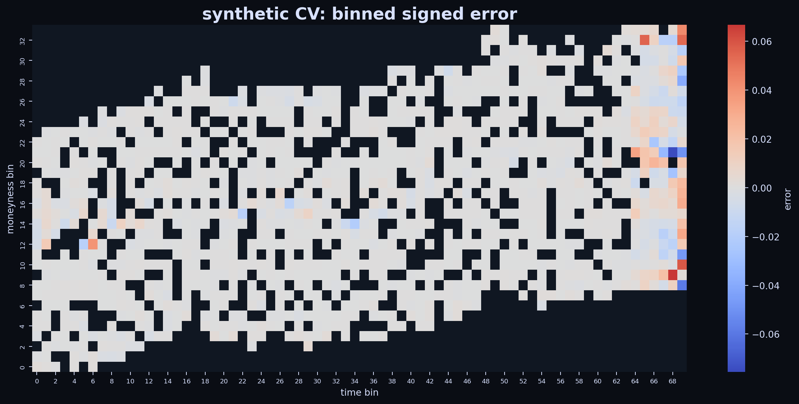

One top-error smile is shown below. It shows whether the miss came from a whole-smile shift, wing movement, or thin local context.

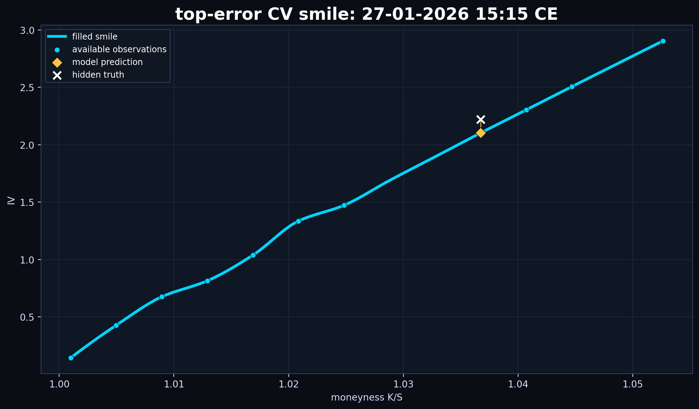

## 8. What I Tried

I tried several model families before choosing the final one.

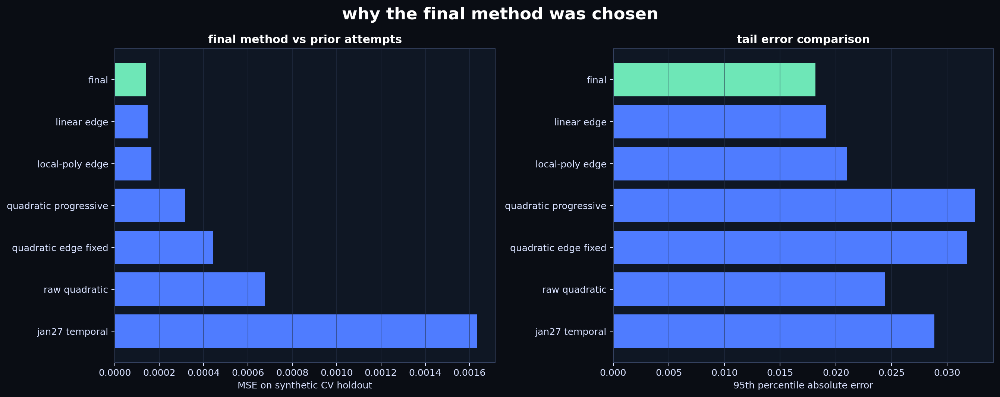

The raw quadratic approach was a useful baseline, but global quadratic wing extrapolation was unstable.

The progressive quadratic edge versions were the first strong structural improvement: edge blocks should be filled from the observed boundary outward.

The linear-edge experiments showed that degree selection matters. Sometimes a line is safer than a quadratic at the wing, but forcing every edge to be linear throws away real curvature.

The local-polynomial edge experiments were stronger because they kept the fit local in moneyness and selected smoothing by validation.

The Jan 27 temporal experiments showed why over-specializing to expiry day is risky. Time information helps explain the market, but a global temporal correction can create large tail errors when the smile changes abruptly.

The CNN idea was conceptually attractive because an IV smile is a 1D signal, but the dataset is small and validation/leakage risk is high. The final method stayed transparent, cross-sectional, and easy to diagnose.

The final model is the practical conclusion:

```text
use same-row smile structure first
separate interiors from edges
choose smoothing by LOO
blend PCHIP only for safe interior interpolation
fill edge blocks progressively
avoid aggressive temporal corrections in the final submission
```

## 9. Function Map

| Function | Role |
|---|---|
| `parse_metadata` | Extracts strike, expiry, and option type from contract names. |
| `collect_same_row_points` | Builds same-timestamp CE or PE smile points. |
| `local_poly_wls_pred` | Core local weighted least-squares predictor. |
| `select_bandwidth_by_loo` | Chooses interior bandwidth by leave-one-out MSE. |
| `select_bandwidth_and_degree_by_loo` | Chooses edge bandwidth and degree. |
| `pchip_same_row_pred` | Computes shape-preserving interior interpolation. |
| `get_edge_blocks` | Finds missing wing blocks at each timestamp. |
| `predict_non_edge_local_poly` | Runs interior WLS plus PCHIP blend. |
| `predict_edge_ensemble` | Builds and combines the three edge estimates. |
| `predict_cell` | Routes each missing cell to the correct engine. |
| `build_missing_cell_fill_order` | Enforces progressive edge filling order. |
| `main` | Loads data, fills all cells, writes submission and diagnostics. |

## 10. Rebuilding Figures

The README-specific figure generator is:

```bash
python for_generating_readme/generate_readme_eda.py
```

It reads the final filled dataset, diagnostics, original dataset, and synthetic CV outputs. It writes the images and interactive Plotly surfaces into:

```text
for_generating_readme/
```

The CV evaluator outputs used by the README live in:

```text
for_generating_readme/cv_eval_final_submission/
```

So this README is tied to generated artifacts from the actual final submission run, not hand-written summaries.
