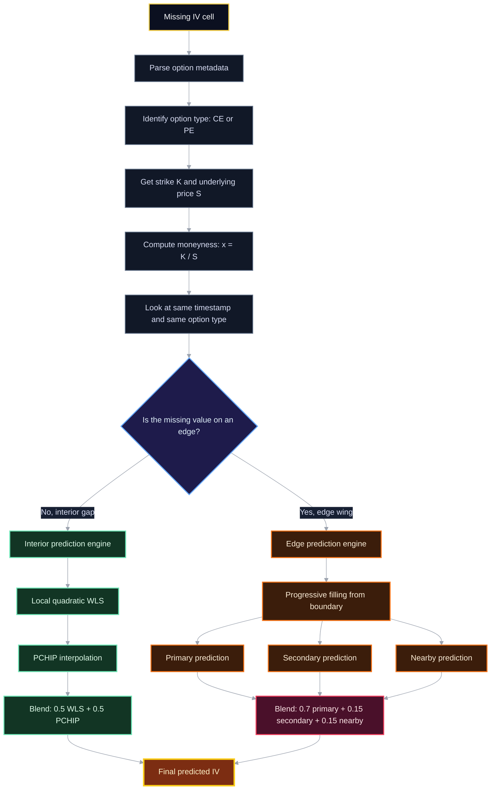
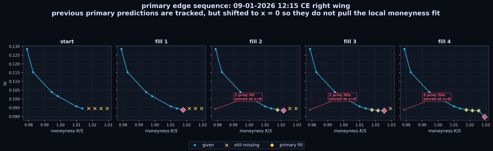
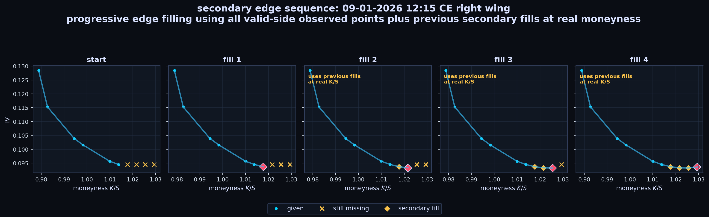
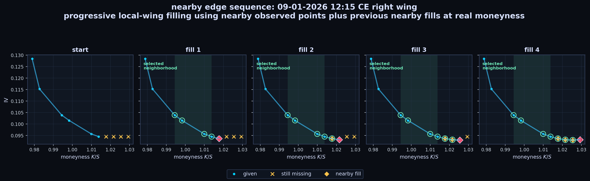
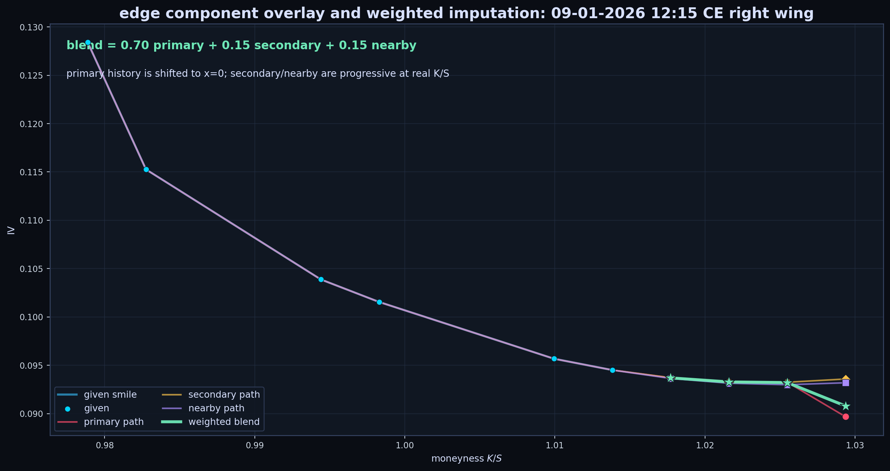
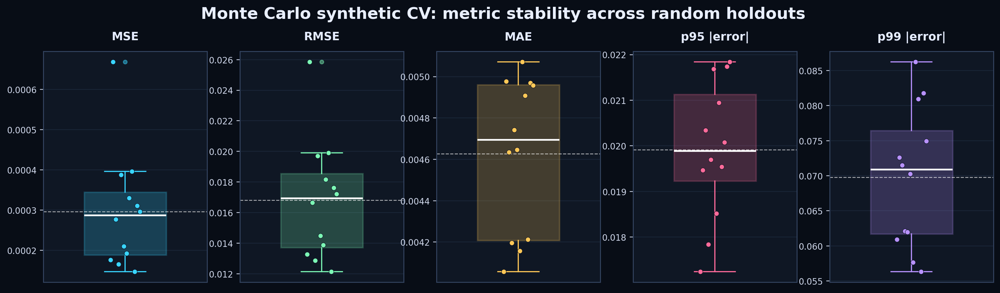
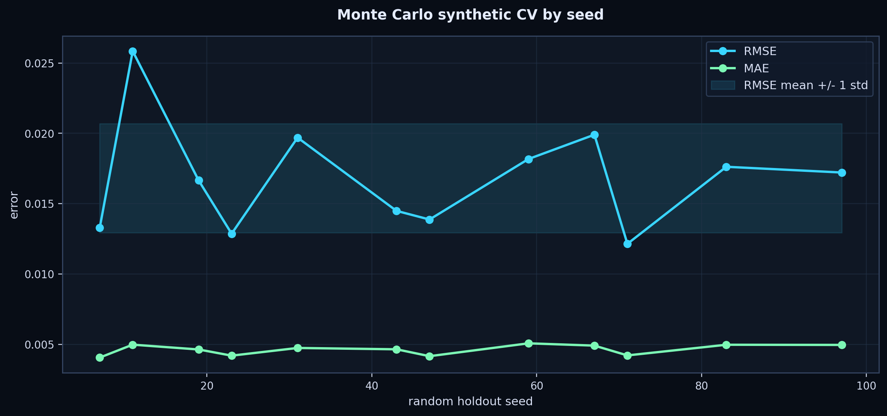
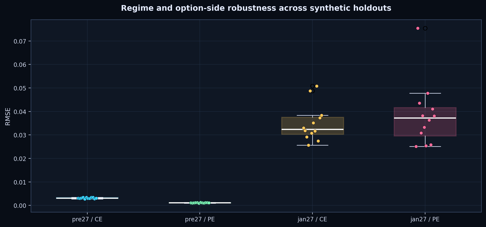
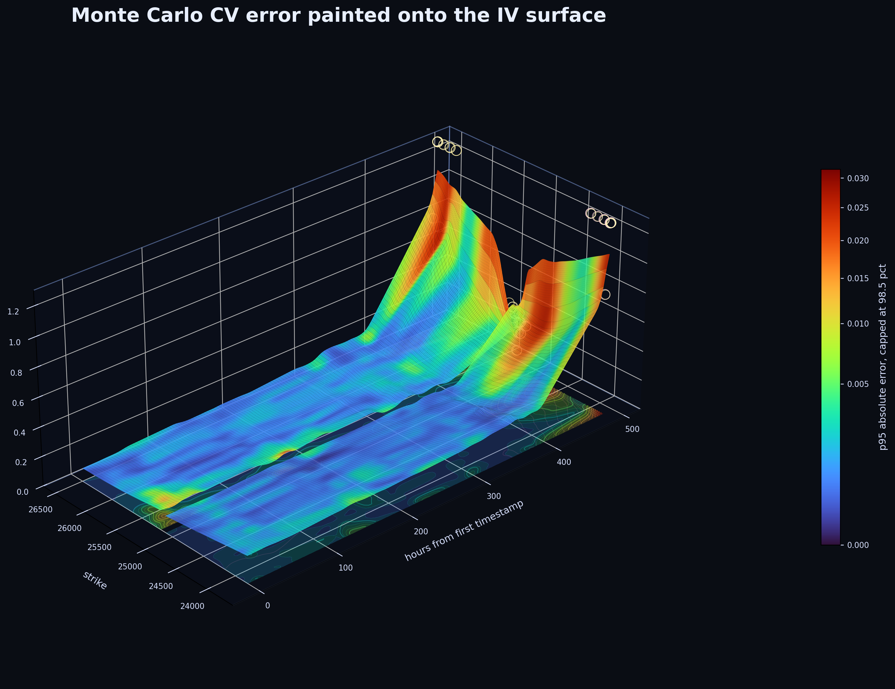

# Implied Volatility Prediction across the Nifty50 options chain (PROJECT REPORT)

This README file is the __project report__ for IITR Finclub Open Projects 2026 PS-2

Implied volatility (IV) measures how much the market believes the price of a stock (or other underlying asset) will move in the future. In practice, IV is one of the most important quantities in options markets because it captures the market’s expectations of future uncertainty and typically varies across strikes, forming structures known as __volatility smiles__ or __volatility skews__.

The objective of this project is to reconstruct a partially observed implied-volatility surface. Rather than treating the task as generic missing-value problem, I approach the problem as a cross-sectional structure prediction problem. My final submission ([final_submission.py](final_submission.py)) does not take into account any temporal dependencies, as I found that for this particular problem, cross-sectional structure across moneyness and IV generate high quality signals.

The remainder of this README is organized as follows. First, I present exploratory analysis of the dataset motivating the modeling decisions. Next, I describe the final methodology, including the interpolation and extrapolation procedures used for interior and edge regions of the smile, which was critical in reducing overall mse. I then present diagnostics, validation results, and finally, comparisons against alternative approaches (some of which were very promising and innovative), which unfortunately did not work for this dataset.

Before moving to the solution, the repository is centered around one file: [final_submission.py](final_submission.py).

That is the file I am submitting. It fills the missing implied-volatility values and writes the final submission file: [submission_final.csv](submission_files/submission_final.csv).

To run it from the repository root, run the following in terminal or run the [final_submission.py](final_submission.py) file:

```bash
python final_submission.py --data dataset.csv 
```

It produces [filled_dataset_final.csv](submission_files/filled_dataset_final.csv), [submission_final.csv](submission_files/submission_final.csv), [diagnostics_final.csv](submission_files/diagnostics_final.csv), and [cross_section_diagnostics_final.csv](submission_files/cross_section_diagnostics_final.csv).

On the final full dataset run, the script filled `5,460` missing IV cells. I've stored the 4 generated files in the folder [submission_files/](submission_files/).

The rest of the directory contains submission files, eda files, validation system files that I used during the competition. All the files in the folder [everything_else/](everything_else/) helped me make the final submission.

## Table Of Contents

- [1. Dataset EDA / Visualisation](#1-dataset-eda-exploratory-data-analysis--visualisation)
- [2. Problem Reduction](#2-problem-reduction)
- [3. Final IV Surfaces](#3-final-iv-surfaces)
- [4. Filling Logic](#4-filling-logic)
  - [4.1 Metadata Parsing](#41-metadata-parsing)
  - [4.2 Same-Row Data Collection](#42-same-row-data-collection)
  - [4.3 Detecting Interior Values and Edge Values](#43-detecting-interior-values-and-edge-values)
  - [4.4 Fill Order](#44-fill-order)
  - [4.5 Interior Cell Prediction](#45-interior-cell-prediction)
  - [4.6 Edge Cell Prediction](#46-edge-cell-prediction)
  - [4.7 Primary Edge Predictor](#47-primary-edge-predictor)
  - [4.8 Secondary Edge Predictor](#48-secondary-edge-predictor)
  - [4.9 Nearby Edge Predictor](#49-nearby-edge-predictor)
  - [4.10 Final Edge Ensemble](#410-final-edge-ensemble)
- [5. Diagnostics](#5-diagnostics)
- [6. Synthetic CV Validation and MC analysis](#6-synthetic-cv-validation-and-mc-analysis)
  - [Monte Carlo Synthetic CV Robustness](#monte-carlo-synthetic-cv-robustness)
- [7. What I Tried](#7-what-i-tried)
- [8. Directory Structure](#8-directory-structure)
- [9. Future Improvements](#9-future-improvements)

Quick repository links:
[final submission script](final_submission.py) |
[dataset](dataset.csv) |
[final outputs](submission_files/) |
[README figure generator](for_generating_readme/generate_readme_eda.py) |
[edge diagram generator](for_generating_readme/generate_edge_component_images.py) |
[Monte Carlo CV runner](for_generating_readme/run_monte_carlo_cv.py) |
[synthetic CV system](everything_else/cv_validation_system/) |
[EDA folder](everything_else/eda/) |
[things tried](everything_else/things_tried/) |
[strategy archive](everything_else/strategies_and_results/)

## 1. Dataset EDA (Exploratory Data Analysis) / Visualisation

This section sets the motivation for all my methods and decisions presented in this report. This was my first step in the competition.

The original dataset is a __Nifty50__ options chain surface (obviously with missing values) expiring on __27th Jan 2026__. It has `975` timestamp rows, `28` option contracts (14 Put options and 14 Call options), and `5,460` missing IV (Implied Volatility) cells, which is exactly `20%` of the all the options' IVs. Furthermore, since the missing values for each option were distributed randomly across time and not in a set train/test dataset, it seemed implausible that any ML/DL model would work, but nonetheless, I tried a few ML/DL approaches (and even a CNN-based method) all of beared no fruit.

Moving ahead, the first important observation is that this is not one smooth time regime. All days from Jan 7 to Jan 23 have low, stable IV, but Jan 27 is different. Since it was the expiry day of all options, we expect the IVs to have a very fastly increasing surface, which is what we observed as shown in the picture(s) below. In the pictures below, we clearly observe a regime shift (pre 27th Jan and 27th Jan). After looking at more expiry day IV prediction research papers, and not finding anything useful, I decided to just use different hyperparameters for both regimes and that is what the current solution does as well. However, I feel there is much to be dug upon on this topic.


#
The missingness is also very uniformly, but randomly distributed. Each timestamp gives a partial CE (call option) smile and a partial PE (put option) smile across strikes. As you can see from the picture below (given and missing values across time and moneyness), there is no pattern to be found from the structure of missing data. Furthermore, looking at the below figure, it gives a clear direction to proceed it - to focus not too much on previous timestamps, but on the cross-sectional structure (IV smile and skew) per timestamp.


#
Further analysis of Raw smiles make the regime shift obvious by observing the scale of Y-axis in the 6 figures below. Early smiles are low and calm, while Jan 27 smiles become increasing steep and noisy (if looked at across time).


This EDA is the reason I trusted same-timestamp smile structure more than a global time-series smoother. Although the lag-1 EDA showed high adjacent-time correlation Jan 27 has much larger IV changes for the lag-1 signal to effectively capture (or atleast that's what I found).

Further EDA files can be found in the folder [everything_else/eda/](everything_else/eda/), especially the interactive surface and dashboard scripts such as [iv_moneyness_time_slider_matplotlib_missing.py](everything_else/eda/iv_moneyness_time_slider_matplotlib_missing.py), [iv_contract_time_series_dashboard.py](everything_else/eda/iv_contract_time_series_dashboard.py), and [nifty_iv_surface_comprehensive_eda.ipynb](everything_else/eda/nifty_iv_surface_comprehensive_eda.ipynb).


## 2. Problem reduction 

This section presents the reduction/translation of the problem statement into a geometry problem along with a key insight I realized (after 60 submissions!)

The model treats each timestamp as an implied-volatility smile, and thus solves for missing values using geometric fits. For a missing option cell, the problem reduces to:

> Fit a curve given the datapoints that represent the current underlying asset scenario. The curve should be a function of IV vs moneyness. Now, I just had to find the "best" curve.

We know, moneyness describes an option's value at a particular point in time. It relates to the option's strike price and the price of its underlying asset and indicates whether the option would make money if it were exercised immediately.

After trying various functions of strike and underlying price, I found that a simple ratio works the best. 

Thus, we define `moneyness (= x)` as:

```math
x = \frac{K}{S}
```

where `K` is strike and `S` is the underlying price.

Now, the key observation that was responsible for reducing the mse was __to classify missing values based on their relative positions across the respective option class (call/put).__

Thus, every missing cell is "routed" into one of two geometries:

```text
interior gap: the missing value was surrounded by non-missing values
edge wing: the missing value was not surrounded by non-missing values on both sides (ie: it was on an "edge")
```

Clearly, interior gaps are safer and easier to predict because there are observed strikes on both sides. However edge wings are harder and not accurate because the model has to extend the smile beyond the observed support, without regression on the other side.

## 3. Final IV Surfaces
Before moving on to the actual solution part, this section presents the results on a 3D graph of strike, time to expiry, and iv. 

These surfaces are generated from the final filled dataset produced by [final_submission.py](final_submission.py). The small bright dots represent IV values that were already present in the original dataset. The smooth surface represents the completed IV surface after the final method inferred the missing cells. The filled dataset itself is stored at [submission_files/filled_dataset_final.csv](submission_files/filled_dataset_final.csv).


The interactive versions of these surfaces are also stored as [CE HTML](for_generating_readme/iv_surface_ce_3d.html), [PE HTML](for_generating_readme/iv_surface_pe_3d.html), and [combined HTML](for_generating_readme/iv_surface_combined_3d.html).

As mentioned before, the final surface is not generated by fitting one global model to all timestamps. Instead, each timestamp is treated as its own cross-sectional option smile. This matters because the IV surface is not stationary across time. The expiry-day regime, especially Jan 27, has much steeper and noisier IV behavior than the earlier dates as clearly visible from the graph(s) above.

One more thing to notics is that for each row, CE (call) values are filled using CE values from the same row, and PE (put) values are filled using PE values from the same row.  This decision was made after noting a little asymetry of the volatility smile.


## 4. Filling Logic
This section discusses a lot of the function definitions of the imputure that contribute as helper functions to the main logic.
The distinction of classifying a missing value as `interior` and `edge` is the main structural choice in the final solution (compared to some of the earlier trials). 

Interior gaps are handled with local weighted regression plus PCHIP interpolation in an ensemble. Edge gaps are handled with progressive extrapolation and an edge ensemble of three methods that we will discuss in this section.


> We note that the late surface jump is the key visual queue that prompted me to classify missing values. As we saw, near expiry, IV rises sharply and the wings become much harder to extrapolate. This is why a single global quadratic, a single time-series smoother, or a direct machine-learning model was not enough.

The full pipeline is charted below. It shows a clear classification based split based on the above discussed class - 


#

### 4.1 Metadata Parsing
In accordance with the metadata naming mentioned in the PS, the function `parse_metadata(df)` extracts this information using the regex:

```python
r"^(?P<underlying>[A-Z]+)"
r"(?P<expiry>\d{2}[A-Z]{3}\d{2})"
r"(?P<strike>\d+)"
r"(?P<option_type>CE|PE)$"
```

For every option column, it stores:

```text
column name
underlying
expiry
strike
option type: CE or PE
expiry date
```

And creates three important maps that are used everywhere ahead:

```python
strike_map = dict(zip(meta["column"], meta["strike"]))
type_map   = dict(zip(meta["column"], meta["option_type"]))
cols_by_type = {
    "CE": [all CE columns],
    "PE": [all PE columns],
}
```
#
### 4.2 Same-Row Data Collection

For a given row and option type, the function `collect_same_row_points` collects all observed IV values of that option type at that timestamp.

For example, if the target is a missing CE value, it collects only observed CE values from the same row.

The function returns:

```text
x_obs      = observed moneyness values (K/S)
y_obs      = observed IV values
used_cols  = option columns used as training points
```

So the training data for one row becomes:

```math
(x_1,y_1), (x_2,y_2), \ldots, (x_n,y_n)
```

where:

```text
x_i = strike / underlying price
y_i = observed implied volatility
```

Now, this training data is then used for prediction across a cross-section.
#
### 4.3 Detecting Interior Values and Edge Values
This is the block that acts as the classifier. This block assigns a the class of `edge` or `interior` which will be used in the code ahead.
The function `get_same_side_state` builds a sorted table for one timestamp and one option type:

```text
column
strike
is_missing
iv
```

It sorts by strike and thus converts the row into a one-dimensional vector as exemplified below.

For example:

```text
strike:     24000   24100   24200   24300   24400   24500
observed:   yes     yes      no      yes      no      no
```

The function `get_edge_blocks` checks missing values at the two ends.

As an example, a left-edge block looks like this -  
 `missing missing observed observed observed`

While, a right-edge block looks like this -  
 `observed observed observed missing missing`

The code is such that the fill order is stored carefully, in a proper order based on the side it is on. In other words, the model fills the missing value closest to the observed boundary first. That is - 

For the left and right edges:
```python
left_fill_order = list(reversed(left_block))
right_fill_order = list(reversed(right_block))
```

Then, the function `is_edge_missing` then decides whether a target missing cell is:

```text
left edge
right edge
all missing same side
not edge
```
#
### 4.4 Fill Order

The function `build_missing_cell_fill_order` creates the final order in which missing values are filled.

For every row and for each option type, it orders missing values in the format shown below. This is so as to ensure that filling of missing values is done based on the order shown visualised in the progressive filling diagrams: [primary](for_generating_readme/edge_primary_sequence.png), [secondary](for_generating_readme/edge_secondary_sequence.png), and [nearby](for_generating_readme/edge_nearby_sequence.png).

```text
left edge block, nearest boundary first
interior missing values, in strike order
right edge block, nearest boundary first
```
In code, this is implemented using -
```python
ordered = list(left_fill) + interior + [c for c in right_fill if c not in left_fill]
```

---

## 4.5 Interior Cell Prediction

As mentioned earlier, `interior cells` are missing values that lie inside the observed smile support. For these, the model uses a blend of `local quadratic weighted least squares` and `PCHIP interpolation`. 


### 4.5.1 Local Quadratic Weighted Least Squares

For target moneyness `x_0`, the model fits a __local quadratic__ around the target:

```math
y_i
\approx
\beta_0
+
\beta_1(x_i-x_0)
+
\beta_2(x_i-x_0)^2
```

The design row for each observed point is:

```math
X_i =
\begin{bmatrix}
1 & (x_i-x_0) & (x_i-x_0)^2
\end{bmatrix}
```

The prediction at the target is:

```math
\hat{y}(x_0)=\beta_0
```

This is because at the target point:

```math
x_i-x_0=0
```

so the fitted curve becomes:

```math
\beta_0+\beta_1\cdot 0+\beta_2\cdot 0^2=\beta_0
```

The model gives more importance to nearby moneyness points using Gaussian-style weights:

```math
w_i =
\exp\left(
-\frac{(x_i-x_0)^2}{2h}
\right)
```

Here, `h` is the bandwidth. Smaller `h` means the model focuses more tightly on nearby strikes. Larger `h` makes the fit smoother and more global.

The weighted least-squares problem is:

```math
\hat{\beta}
=
\arg\min_{\beta}
\sum_i
w_i
\left(
y_i-X_i\beta
\right)^2
```

In matrix form:

```math
(X^\top W X)\hat{\beta}
=
X^\top W y
```

The code solves this using:

```python
np.linalg.solve(X.T @ WX, X.T @ (weights * y_obs))
```

Its good to note here that, if the linear system is singular, the code falls back to a weighted average:

```python
(weights @ y_obs) / weights.sum()
```

### 4.5.2 Bandwidth Selection by Leave-One-Out Method (LOO Method)

The bandwidth is selected by leave-one-out cross-validation inside the same row. The values that the bandwidth goes over is known as the grid (This is a grid-search problem). 
This grid is obtained by first running a wide grid search and eventually narrowing it down to these values. 

The selected grid turned out to be: 
```python
BANDWIDTH_GRID = np.array([5e-5, 7e-5, 1e-4, 1.5e-4, 2e-4])
```

For each candidate bandwidth `h`, the model temporarily removes each observed point, predicts it using the remaining points, and computes the squared error.

For one bandwidth:

```math
\mathrm{MSE}(h)
=
\frac{1}{n}
\sum_i
\left(
\hat{y}_{-i}(x_i;h)-y_i
\right)^2
```

Then the selected bandwidth is:

```math
h^\star
=
\arg\min_h
\mathrm{MSE}(h)
```

This is implemented by:

```python
select_bandwidth_by_loo
```

The actual prediction then uses:

```python
best_bw, loo_mse = select_bandwidth_by_loo(x_obs, y_obs, BANDWIDTH_GRID)
base_pred = local_poly_wls_pred(x_obs, y_obs, x_target, best_bw, degree=2)
```

Again, we note here that the bandwidth is selected per row, and not for the entire timeframe. This is because of the two regimes (pre 27 and 27th jan) existing. We make sure to not select very different bandwidths so as to increase robustness and overfitting. As the theory/observations suggest (there existing two different regimes, and thus a need for different weight selection), I also validated this during the competition, which evidently reduced the MSE. 

### 4.5.3 PCHIP Interpolation

After the local quadratic WLS prediction, the model also computes a PCHIP prediction.

PCHIP is a famous interpolation methods that stands for Piecewise Cubic Hermite Interpolating Polynomial. I used this because I wanted to introduce a cubic term (as I already had a quadratic term). Also, another benefit of PCHIP is that it is shape-preserving. A normal cubic spline can overshoot between points when the smile has sharp bends. However, PCHIP is more conservative because it tries to preserve the local monotonicity and shape of the data. 

We note that PCHIP is used only if if there are atleast 4 neighbours available. 

The important safety rule is:
```python
if not (x[0] <= x_target <= x[-1]):
    return np.nan
```

So PCHIP is never used for extrapolation. It is only used for interior interpolation.

Before fitting PCHIP, the code:
1. Filters non-finite values.
2. Sorts points by moneyness.
3. Collapses duplicate moneyness values by averaging their IVs.
4. Rejects the prediction if fewer than `MIN_PCHIP_POINTS = 4` unique points remain.
5. Rejects extrapolation.

The PCHIP prediction is:
```math
\hat{y}_{\mathrm{PCHIP}}(x_0)
```
Now, the final interior prediction is a blend:

```math
\hat{y}_{\mathrm{interior}}
=
0.5\hat{y}_{\mathrm{WLS}}
+
0.5\hat{y}_{\mathrm{PCHIP}}
```

In code:

```python
pred = (1.0 - PCHIP_INTERIOR_WEIGHT) * base_pred + PCHIP_INTERIOR_WEIGHT * pchip_pred
```

with:

```python
PCHIP_INTERIOR_WEIGHT = 0.5
```

If PCHIP is unavailable or invalid, the model uses only the WLS prediction.

We note here that I used a weight of `0.5` so as to add robustness in the model. My intuition behind it was to incldue a cubic term along with a quadratic term (which is added by the LOO-WLS method). Fortunately, the combination worked as I validated from the actual submission mse on kaggle and by the [cv_validation_system](everything_else/cv_validation_system/) (which can be found in [everything_else/](everything_else/)). 
The weights were not optimised using a parameter optimisation method so as to prevent any overfit. Nevertheless, I ran a script that did exactly that and found that the mse did not change significantly across the blend, thus making me choose robustness over a small improvement of MSE.   

---

## 4.6 Edge Cell Prediction

Edge cells are the most difficult part of the problem. They are missing values at the outer wing of a CE or PE smile, and contribute to __most__ of the error.

As seen previously, a right edge can look like: 
 `observed observed observed missing_1 missing_2 missing_3`

And a left edge can look like: 
 `missing_3 missing_2 missing_1 observed observed observed`


The model does not fill all missing edge values independently. Instead, it fills from the observed boundary outward.

For a right edge:

```text
missing_1 first
missing_2 second
missing_3 third
```

For a left edge:

```text
missing_1 first
missing_2 second
missing_3 third
```

where `missing_1` is always the missing value closest to the observed region. This matters because once `missing_1` is predicted, it becomes __"context"__ for predicting `missing_2`.

As shown in the initial pipeline diagram, the edge prediction uses three separate components as mentioned below and later are combined as an ensemble with weights decided using a grid search paired with the [cv_validation_system](everything_else/cv_validation_system/). The three methods' indepth explanation follows this section.

```text
__primary__
__secondary__
__nearby__
```

The final edge prediction is:

```math
\hat{y}_{\mathrm{edge}}
=
0.7\hat{y}_{\mathrm{primary}}
+
0.15\hat{y}_{\mathrm{secondary}}
+
0.15\hat{y}_{\mathrm{nearby}}
```

#
Each of the 3 sections that follow now contain first the python function that implements that part of the logic and then explains the core logic. 

---

## 4.7 Primary Edge Predictor

The primary edge predictor, is implemented by:


`collect_edge_training_points_primary`\
`predict_edge_primary_local_poly`


### 4.7.1 What Training Points It Uses

For an edge target, the function first identifies - `side`, `block_cols`, and `position`, where:

```text
side = left or right edge
block_cols = all missing columns in that edge block, ordered by fill order
position = current missing value's index inside that edge block
```

Then it builds observed training points from the valid side of the smile.

That is, 
If the target is on the right edge, only observed strikes smaller than the target strike are used:
```python
base = obs[obs["strike"] < target_strike].sort_values("strike")
```
This corresponds to:
```text
observed observed observed target
```

And if the target is on the left edge, only observed strikes larger than the target strike are used:
```python
base = obs[obs["strike"] > target_strike].sort_values("strike")
```
This corresponds to:
```text
target observed observed observed
```

For each observed point, the training coordinate is:
```math
x_i = \frac{K_i}{S}
```
and:
```math
y_i = \mathrm{IV}_i
```

So the initial primary training set is:

```math
\{(K_i/S,\ IV_i)\}
```
__from the observed side of the smile.__

### 4.7.2 Progressive Context (not really for this method)

The primary predictor then adds earlier predictions from the same edge block.

This part is controlled by:
```python
prev = block_cols[:int(position)] if np.isfinite(position) else []
```

So if the model is currently predicting the third missing value in an edge block, it __can__ use the first two missing values that were already predicted. Note that in this method, we are not really using the previous predictions as we are setting `x:=0` and thus putting it in the beggining of the `x_i` series => getting very less weight. But it is important to note that we are still progressive in the sense that the weights of the same non-missing values are now different for each missing value (as the distance from target is increasing as we go out). We discuss this ahead with an example as well.
Note - I kept the terminology of "progressive" so as to make the transition and connection between the 3 ensemble methods fluid.

For each previous edge prediction:
```python
pv = component_value(already_filled, pc, "primary")
```

If that previous primary prediction is finite, the code appends:
```python
x_t.append(0.0) #this is the part which is unusual 
y_t.append(float(pv))
used.append(f"{pc}*as_xy")
```

As discussed previously, this is intentionally unusual. The previous prediction is stored as a `y` value, but its `x` coordinate is set to `0`. The answer to "Why we do this?" is answered ahead, but first we discuss what happens because of this -

For a previously filled edge contract, the point inserted into the primary training set is:
```math
x_{\mathrm{dummy}} = 0
```
```math
y_{\mathrm{dummy}} = \hat{y}_{\mathrm{prev,primary}}
```

This works because the local polynomial predictor is kernel weighted around the target moneyness. For a target point:

```math
x_0 = \frac{K_0}{S}
```

the weight attached to any training point `x_i` is:

```math
w_i(x_0)
=
\exp\left(
-
\frac{(x_i-x_0)^2}{2h}
\right)
```

where `h` is selected from:

```math
h \in
\left\{
5\cdot 10^{-5},
7\cdot 10^{-5},
10^{-4},
1.5\cdot 10^{-4},
2\cdot 10^{-4}
\right\}
```

For the option strikes in this dataset, moneyness is close to `1`, not close to `0`, thus a __"dummy"__ previous prediction at `x=0` is therefore extremely far away from any real target moneyness. If the target is, for example:

```math
x_0 = 1.04
```

and the largest bandwidth is used:

```math
h = 2\cdot 10^{-4}
```

then clearly, the dummy point's weight is:

```math
w_{\mathrm{dummy}}
=
\exp\left(
-
\frac{(0-1.04)^2}{2(2\cdot10^{-4})}
\right)
=
\exp(-2704)
\approx 0
```

By contrast, a real observed point at `x=1.02` receives:
```math
w_{\mathrm{real}}
=
\exp\left(
-
\frac{(1.02-1.04)^2}{2(2\cdot10^{-4})}
\right)
=
\exp(-1)
\approx 0.3679
```

So the __"dummy"__ point is present in the training arrays, but it has almost no numerical influence on the local weighted fit. This was the key idea: the previous predictions are not allowed to influence the next predictions at all. I could've coded and implement this using a different, maybe more efficient way, but I chose this because it creates similarity between the 3 methods - `primary, secondary, and nearby`. It is neccessary to note here that I put x=0 just to __"remove"__ that from the training set for the "next" missing value. 

Thus, the weighted least-squares fit being solved is:
```math
\min_{\beta}
\sum_i
w_i(x_0)
\left(
y_i
-
\sum_{j=0}^{d}
\beta_j (x_i-x_0)^j
\right)^2
```

Since:

```math
w_{\mathrm{dummy}} \approx 0
```

Thus,
```math
w_{\mathrm{dummy}}
\left(
y_{\mathrm{dummy}}
-
\sum_{j=0}^{d}
\beta_j (0-x_0)^j
\right)^2
\approx
0
```

This makes the primary edge predictor behave like a mostly pure __"observed-side"__ extrapolator. That is useful because if earlier predicted edge values are fed back at their true moneyness locations, later edge values can start chasing the model's own guesses. This component avoids that feedback loop by keeping previous predictions numerically harmless.

We note that this is a well established mathematically sound method, just implemented in a different method. For more clarificaton, go to [-sectionlast](#add a last appendix to explain this). It is an emperical method executed by setting `x=0`. Thus, the primary component remains conservative by extrapolating mainly from observed same-side smile points, while the other edge components (`secondary` and `nearby`) provide the versions that __do use previous predictions__ at real moneyness locations.



### 4.7.3 Primary Prediction Model

After collecting primary training points, the model calls:

```python
_edge_predict_with_deg_select
```
This helper selects both:
```text
degree d
bandwidth h
```
by leave-one-out (LOO) validation.

The candidate degrees are:
```math
d \in \{1,2\}
```
And the candidate bandwidths are:
```math
h
\in
\left\{
5\cdot10^{-5},
7\cdot10^{-5},
10^{-4},
1.5\cdot10^{-4},
2\cdot10^{-4}
\right\}
```

For each pair `(d,h)`, the code performs leave-one-out prediction on the edge training set:
```math
\mathrm{LOO\_MSE}(d,h)
=
\frac{1}{n}
\sum_{i=1}^{n}
\left(
\hat{y}_{-i}(x_i;d,h)-y_i
\right)^2
```
Then it selects:

```math
(d^\star,h^\star)
=
\arg\min_{d,h}
\mathrm{LOO\_MSE}(d,h)
```


__Thus, the final primary prediction is:__
```math
\hat{y}_{\mathrm{primary}}
=
\hat{y}(x_0;d^\star,h^\star)
```

If the selected fit fails, it falls back to ` bandwidth = 2e-4 and degree = 1 `. And, if that also fails, it falls back to the global median IV.

---

## 4.8 Secondary Edge Predictor

The "secondary" edge predictor is implemented by:

```python
collect_edge_training_points_secondary
predict_edge_secondary_local_poly
```

This predictor is similar to the primary predictor, but it is critically different than the primary in the sense that this __DOES__ use the previous predictions during prediction of any missing value. That is - `where the primary predictor put x=0, the secondary puts x=x.`

### 4.8.1 What Training Points It Uses

Like the primary predictor, the secondary predictor first uses observed values from the valid side.

For a right edge, it uses observed strikes smaller than the target strike:
```python
if side == "right" and s < target_strike:
```
For a left edge, it uses observed strikes larger than the target strike:
```python
if side == "left" and s > target_strike:
```

Each observed point is added as:

```python
"x": strike / spot
"y": observed IV
"is_predicted": False
```

Following the similarit from the primary model - 

```math
x_i = \frac{K_i}{S}
y_i = \mathrm{IV}_i
```

### 4.8.2 Secondary Progressive Context
This part explains the implementation of the method.

In code, for previous predictions in the same edge block, the secondary model does this:

```python
pv = component_value(already_filled, pc, "secondary")
```
And then it __appends__:
```python
"x": strike_map[pc] / spot #and not x=0
"y": float(pv)
"is_predicted": True
```

So unlike the primary predictor, the secondary predictor uses:
```math
x_{\mathrm{prev}} = \frac{K_{\mathrm{prev}}}{S}
y_{\mathrm{prev}} = \hat{y}_{\mathrm{prev}}
```

This is the geometrically natural version of __"progressive" filling__.

Clearly, this method follows the flow mentioned below - 
```text
The previous missing option now has a predicted IV.
Place that predicted IV at its real moneyness location.
Use it as an additional training point for the next missing edge value.
```

So if the model has:

```text
observed observed observed missing_1 missing_2
```

then after filling `missing_1`, the secondary model for `missing_2` sees:

```text
observed observed observed predicted_missing_1 target_missing_2
```

### 4.8.3 Secondary Prediction Model

Once the secondary training points are collected, prediction again uses:
```python
_edge_predict_with_deg_select
```
So secondary also selects:
```text
degree in {1,2}
bandwidth from BANDWIDTH_GRID
```
by leave-one-out MSE.

Thus, the secondary prediction is:
```math
\hat{y}_{\mathrm{secondary}}
=
\hat{y}(x_0;d^\star,h^\star)
```

This component gives the ensemble a more geometrically consistent / natural version of the __"progressive"__ edge extrapolation. By implementing both the secondary and the primary, I aimed to create an ensemble with a robust edge filling logic.



---

## 4.9 Nearby Edge Predictor

The nearby edge predictor is implemented by:
```python
collect_edge_training_points_nearby
predict_edge_nearby
```
As the name suggests, this method of edge imputing is derived from applying the `secondary` method on a local neighbourhood of the target moneyness. I added this so as to account for edge side option IVs having a slightly sharper smile than the interior IVs.

### 4.9.1 Local Wing Neighborhood

The nearby component differs from primary and secondary in how it chooses the observed training points. As mentioned before, instead of using all observed points on the valid side, it selects a local neighborhood near the edge.

The number of needed observed points is:
```python
base_n = max(MIN_EDGE_LOCAL_NEIGHBORS, len(block_cols))
```

where:

```python
MIN_EDGE_LOCAL_NEIGHBORS = 3
```

So:

```text
if the edge block has 1 or 2 missing values, use at least 3 observed neighbors
if the edge block has more missing values, use at least as many observed neighbors as the block size
```

For a right edge, it takes the nearest observed strikes to the left:

```python
base = (
    obs[obs["strike"] < target_strike]
    .sort_values("strike", ascending=False)
    .head(base_n)
    .sort_values("strike")
)
```

This means:

1. Keep only observed strikes smaller than the target.
2. Sort descending so the closest strikes come first.
3. Take `base_n` nearest observed points.
4. Sort back ascending for a clean training order.

For a left edge, it takes the nearest observed strikes to the right:

```python
base = (
    obs[obs["strike"] > target_strike]
    .sort_values("strike")
    .head(base_n)
    .sort_values("strike")
)
```
This is done so as to provide a more __"localised"__ structure of the edge part of the smiles (or skews).
The motivation was simple, `far-away strikes may not describe the wing behavior near the missing edge`.

It is important to note here that I tried quite a few functions (based on moneyness, number of missing values, regime type, etc.) that chooses the neighbourhood, eventually setting upon the simplest of them all (the one showed above). 


### 4.9.2 Nearby Progressive Context

Since this __"nearby__" component is simillar to the __"secondary"__, it also adds previous predictions from the same edge block.

For each previous missing value:
```python
pv = component_value(already_filled, pc, "nearby")
```
it appends:
```python
"x": strike_map[pc] / spot
"y": float(pv)
"is_predicted": True
```
Mathematically:
```math
x_{\mathrm{prev}} = \frac{K_{\mathrm{prev}}}{S}
y_{\mathrm{prev}} = \hat{y}_{\mathrm{prev}}
```

In summary, the difference is that secondary uses all observed valid-side points, while nearby uses only a local wing neighborhood. This method proved to be useful till a point, and thus I chose to put it in the ensemble.



### 4.9.3 Nearby Prediction Model

After collecting the local wing training set, the prediction again calls:
```python
_edge_predict_with_deg_select
```
Therefore, this component also searches:
```math
d \in \{1,2\}
```
and:
```math
h
\in
\left\{
5\cdot10^{-5},
7\cdot10^{-5},
10^{-4},
1.5\cdot10^{-4},
2\cdot10^{-4}
\right\}
```

Thus, the final nearby component prediction is:
```math
\hat{y}_{\mathrm{nearby}}
=
\hat{y}(x_0;d^\star,h^\star)
```

For debugging during the contest, there are a lot of diagnostic statements in the code, like `edge_nearby_fit_kind` , which stores whether the selected model behaved like `deg1_by_loo` or `deg2_by_loo`.

---

## 4.10 Final Edge Ensemble

The python function that combines all edge predictors is:
```python
predict_edge_ensemble
```

It computes:

```python
primary_info = predict_edge_primary_local_poly(...)
primary_pred = primary_info["prediction"]
secondary_pred, secondary_cols, secondary_info = predict_edge_secondary_local_poly(...)
nearby_pred, nearby_cols, nearby_info, fit_kind = predict_edge_nearby(...)
```

These produces the three component predictions:
1. `primary prediction`
2. `secondary prediction`
3. `nearby prediction`


Which, the code stores them as:

```python314
components = {
    "primary": safe_iv(primary_pred),
    "secondary": safe_iv(secondary_pred),
    "nearby": safe_iv(nearby_pred),
}
```

Then it computes the final edge prediction:
```math
\hat{y}_{\mathrm{edge}}
=
0.7\hat{y}_{\mathrm{primary}}
+
0.15\hat{y}_{\mathrm{secondary}}
+
0.15\hat{y}_{\mathrm{nearby}}
```

Which, again, in code is: 

```python
pred = (
    EDGE_BLEND_PRIMARY * components["primary"]
    + EDGE_BLEND_SECONDARY * components["secondary"]
    + EDGE_BLEND_NEARBY * components["nearby"]
)
```

where: `EDGE_BLEND_PRIMARY = 0.7`, `EDGE_BLEND_SECONDARY = 0.15`, `EDGE_BLEND_NEARBY = 0.15`


The reason for this design is that edge extrapolation is noisy. The primary model is the strongest component, so it receives most of the weight. The secondary and nearby components are included with smaller weights as stabilizers. They provide alternative geometric views of the same edge problem without overpowering the main predictor.

It is important to note here the following -
1. The weights here are based on how much improvement in `cv_mse` (mse from a hid-out faked dataset, checked against given values) the method did.
2. We also note that each of the 3 methods (`primary`, `secondary`, and `nearby`) produces a simillar mse of around `~3×10`<sup>`-5`</sup>. Thus, my ensemble _should_ be robust enough to survive the error calculation of the left-out 70% data on Kaggle. 
3. To repeat, the weights are based on how confident I am in the method, and are not completely random as well. I had run a grid search over a few choices of the tuple of weights which gave a better leaderboard score but decided to not go with it so as to slightly increase robustness over minute mse gains. Simply put, I chose the weights by trial and error and settling for the best trade-off of the mse and the confidence in the method.



---

## 5. Diagnostics

The full final run completed every missing value without a global-median fallback.

```text
total filled cells       : 5,460
interior fills           : 4,491
edge fills               : 969
degree 2 edge selections : 812
degree 1 edge selections : 157
global median fallback   : 0
```

The final run outputs behind these diagnostics are [diagnostics_final.csv](submission_files/diagnostics_final.csv) and [cross_section_diagnostics_final.csv](submission_files/cross_section_diagnostics_final.csv).

The first diagnostic figure is a run-level snapshot of the filling process. It separates interior gaps from edge gaps and shows how many cells were handled by each family of model. It also shows which `bw (bandwidth)` was selected how frequently, along with which `deg` was selected how frequently, 


The next figure breaks down the final model decisions. It shows where the method used the smoother interior interpolation and where it switched into the edge extrapolation method(s). This was necessary so as to validate my theories and the sanity of the code; meaning, this is to be taken as "proof" that results are what we expect from a correct code, and thus the code is atleast what we wanted, even if it is not the correct solution. 


The final filled smiles show completed cross-sections after imputation (for coherence, these are the same rows shown at the start of this report). Clearly, as we can see, the model performs well on the showed smiles.


## 6. Synthetic CV Validation and MC analysis

During the competition, to prevent useless submissions on the official kaggle page, I create a synthetic validation system by randomly hiding out some values from the given dataset and testing my code on this synthetic holdout. 
This is located in the repository in [everything_else/cv_validation_system/](everything_else/cv_validation_system/). I mention this part here because this setup was very essential in ruling out some theories and methods that "could've" worked. It provides a comprehensive review of a lot of the error in the method. This was crucial as I could visually see where the model went wrong and thus clearly pinpoint it out in the code itself, rather than combing the code and dry-running it.

In this section, I share one of the synthetic CV results ran on [final_submission.py](final_submission.py) file.

PS- the guidelines and the commands to run this cv are mentioned in the respective folder's [README file](everything_else/cv_validation_system/README.md).

For a randomly selected synthetic hid-out dataset, the model gave the synthetic CV results:
```text
n hidden cells scored : 2621
MSE                   : 0.0001417534
RMSE                  : 0.0119060232
MAE                   : 0.0038038407
median absolute error : 0.0005887275
bias                  : 0.0002157616
p95 absolute error    : 0.0181816275
p99 absolute error    : 0.0615417097
```

The full synthetic CV metric table is stored in [metrics_summary.csv](for_generating_readme/cv_eval_final_submission/metrics_summary.csv), with worst/error-level rows available in [error_rows.csv](for_generating_readme/cv_eval_final_submission/error_rows.csv) and [worst_errors.csv](for_generating_readme/cv_eval_final_submission/worst_errors.csv).

The strongest errors are concentrated near the expiry regime, which matches the EDA and the final IV surface.

Below are a few plots that are useful in undestanding model failures as well as model benefits. 


#

#

#

#

#

#
One top-error smile is shown below. It shows whether the miss came from a whole-smile shift, wing movement, or thin local context.


#

## Monte Carlo synthetic CV robustness

To test whether the synthetic CV result above was just a lucky holdout, and to test the robustness of the model, and to gain some confidence before setting it as the final submission, I repeated the same synthetic validation idea across `12` independently generated random holdout datasets (all derived from the same given dataset). Each run used the same final submission code, but a different random seed for hiding observed IV cells.

And here are the result of the final Robustness Check - 
```text
number of MC runs       : 12
hidden cells per run    : 2621 to 2621
mean MSE                : 0.0002965652
std MSE                 : 0.0001446755
mean RMSE               : 0.0168143457
std RMSE                : 0.0038860506
mean MAE                : 0.0046273639
mean p95 absolute error : 0.0199111351
best seed by RMSE       : 71  (0.0121440186)
worst seed by RMSE      : 11  (0.0258483124)
```

The Monte Carlo summary CSV is [mc_cv_summary.csv](for_generating_readme/mc_cv_summary.csv), and the regime/option breakdown is [mc_cv_grouped_by_regime_option.csv](for_generating_readme/mc_cv_grouped_by_regime_option.csv).

The picture shows the distribution of the main error statistics across random holdouts. The useful thing here is the width of each distribution. Each error type has a narrow spread means the method is independent of the dataset split (obviously as long as the split is uniformly random across both regimes)



The seed trajectory shows the same robustness in a different way. RMSE and MAE move from seed to seed as expected, while staying in the same band instead of exploding for a particular random holdout, again validating the entire method. 



This regime plot separates the synthetic errors into pre-27 Jan and 27 Jan, and also splits CE from PE. It is consistent with what is expected of predicting IV on expiry day. As realised from earlier, the 27 Jan regime was expected to have higher MSE due to its intrinsic randomness. Nevertheless, I think there can be a few improvements on this model if given a lot more data of same-day expiration IVs, but obviously that was not the scope of this project. 



This final plot turns the synthetic CV errors back into a 3D IV object. The horizontal axes are time and strike, the vertical axis is the actual IV level, and the color is the high-tail absolute error seen across the random holdouts. This makes the failure geography visible directly on the IV surface.




## 7. What I Tried

Its clear I tried several model families before choosing the final one. (a lot more than present in `everything/else`)

Shown below is a comparison table listing a tiny fraction of things I tried (apart from some parameter optimised resubmits). The underlying table is also saved as [strategy_cv_comparison.csv](for_generating_readme/strategy_cv_comparison.csv).


At this point, I would like to expand on a few points - 
1. The first thing I tried was a raw quadratic fit, which I set as a baseline. The related script is [quadratic_fit_iv_moneyness.py](everything_else/strategies_and_results/quadratic_fit_raw/quadratic_fit_iv_moneyness.py). Here I realised one key thing, `the main error source across time was jan 27, and across strikes were missing edge values, especially outer edges of the combined smile. 

2. From here, I got the idea of splitting the missing values and getting the classifier in place. Then, I used a few approaches to handle each and landed with the current one. 

3. I also tried adding a temporal dependency, which showed improvement in MSE on leaderboard, but due to less confidence in the method, I finally decided to not use time in 
The raw quadratic approach was a useful baseline, but global quadratic wing extrapolation was unstable.

4. One more attractive idea I tried to implement was using a CNN or a diffusion model to predict the missing IV. The idea was clear - if I can point approximately where the IV should be, so could a deep learning model? But I was wrong. Nevertheless, I achieved a leaderboard score mse (on 30% missing data) of __4.8x10^-5__, which in my opinion could've been improved further if I had the experience. In any case, I tried to implement the following [paper](https://uwaterloo.ca/computational-mathematics/sites/default/files/uploads/documents/ying_kit_hui_research_paper.pdf) which gave the above mentioned leaderboard mse. The related files are [kaggle_cnn_smile_iv_imputer.ipynb](everything_else/things_tried/kaggle_cnn_smile_iv_imputer.ipynb), [try_cnn.py](everything_else/things_tried/try_cnn.py), [try_cnn_fixed.py](everything_else/things_tried/try_cnn_fixed.py), and [score_based_iv_completion_kaggle.ipynb](everything_else/things_tried/score_based_iv_completion_kaggle.ipynb).


## 8. Directory Structure

This section is an appendix for navigating the repository. The main file to run for the final submission is still [final_submission.py](final_submission.py); everything else is either input data, generated output, diagnostics, EDA, validation machinery, or experiments that helped decide what not to submit.

```text
.
├── dataset.csv
├── final_submission.py
├── README.md
├── LICENSE
├── submission-converter.ipynb
├── submission_files/
├── for_generating_readme/
└── everything_else/
    ├── cv_validation_system/
    ├── eda/
    ├── strategies_and_results/
    ├── things_tried/
    ├── monte_carlo_for_try.py/
    └── was_better_than_submission_but_not_confident/
```

[final_submission.py](final_submission.py) is the actual final method. This is the script that reads the original dataset, fills every missing IV, writes the filled dataset, and generates the final submission output. The README is written around this file.

[dataset.csv](dataset.csv) is the original competition dataset. All paths in the final code are relative to the project directory, so the repository can be moved or cloned without changing absolute file paths.

[submission_files/](submission_files/) stores the final generated outputs. The important file in this folder is the [submission CSV](submission_files/submission_final.csv), while the [filled dataset](submission_files/filled_dataset_final.csv) and diagnostic CSVs are kept so the final run can be inspected instead of treated as a black box.

[for_generating_readme/](for_generating_readme/) contains scripts, plots, HTML surfaces, Monte Carlo outputs, and image assets used only to build this report. The 3D IV surfaces, missingness plots, CV plots, progressive filling diagrams, and strategy comparison figures shown above are all generated from here. The main scripts are [generate_readme_eda.py](for_generating_readme/generate_readme_eda.py), [generate_edge_component_images.py](for_generating_readme/generate_edge_component_images.py), and [run_monte_carlo_cv.py](for_generating_readme/run_monte_carlo_cv.py). This folder is not required to understand the final algorithm line-by-line, but it is important for reproducing the visual story of the report.

[everything_else/eda/](everything_else/eda/) contains exploratory analysis scripts and notebooks. This is where I looked at the original IV surface, missingness, moneyness behavior, time behavior, contract-level movement, and the Jan-27 expiry regime. The main purpose of this folder was to understand the data before choosing a model.

[everything_else/cv_validation_system/](everything_else/cv_validation_system/) contains the synthetic validation setup. It creates artificial holdouts from known IV values using [create_synthetic_cv_dataset.py](everything_else/cv_validation_system/create_synthetic_cv_dataset.py), runs a candidate imputer on the masked dataset, and evaluates the predictions against the hidden truth using [evaluate_cv_predictions_with_heatmaps.py](everything_else/cv_validation_system/evaluate_cv_predictions_with_heatmaps.py). This folder was essential because the public leaderboard alone was not enough to safely choose between methods.

[everything_else/things_tried/](everything_else/things_tried/) contains trial scripts and notebooks that were not selected as the final submission. This includes pure cross-section local polynomial attempts, PCHIP variants, temporal Jan-27 variants, underlying-signal experiments, CNN smile-image models, and score-based neural inpainting.

[everything_else/strategies_and_results/](everything_else/strategies_and_results/) contains older strategy folders with both code and generated result CSVs. These are useful as a record of how the method evolved: raw quadratic fits, progressive linear edge handling, adaptive local polynomial versions, expiry-specific experiments, and edge-case-focused variants.

[everything_else/was_better_than_submission_but_not_confident/](everything_else/was_better_than_submission_but_not_confident/) contains a method that looked promising but was not selected because I did not have enough confidence in its generalization. This is important because the final choice was not only based on lowest observed score; it was based on robustness, interpretability, and whether the method made sense under the EDA.

[everything_else/monte_carlo_for_try.py/](everything_else/monte_carlo_for_try.py/) contains a Monte Carlo error-analysis script for testing repeated synthetic holdout behavior.

## 9. Future Improvements

The final method is deliberately local and deterministic. That made it more trustworthy for this dataset, but there are still clear directions where it could be improved if more data or more time were available.

1. Add a stronger expiry-day model. The Jan-27 regime is the hardest part of the dataset. A future version could use several expiry-day option chains from different dates, learn the distribution of same-day IV surface shapes, and then apply that prior to the current expiry date.

2. Build a cleaner temporal component. I tried temporal ideas, but I did not finally trust them enough. A better temporal model would need regime-aware validation, strict causality, and a way to avoid overreacting to short-lived IV jumps.

3. Use neural models only with stronger validation. CNNs and score-based inpainting were attractive, but the dataset was too small for them to be the safest final choice. With more historical option-chain surfaces, a small masked model could become useful as an auxiliary model rather than the main imputer.
