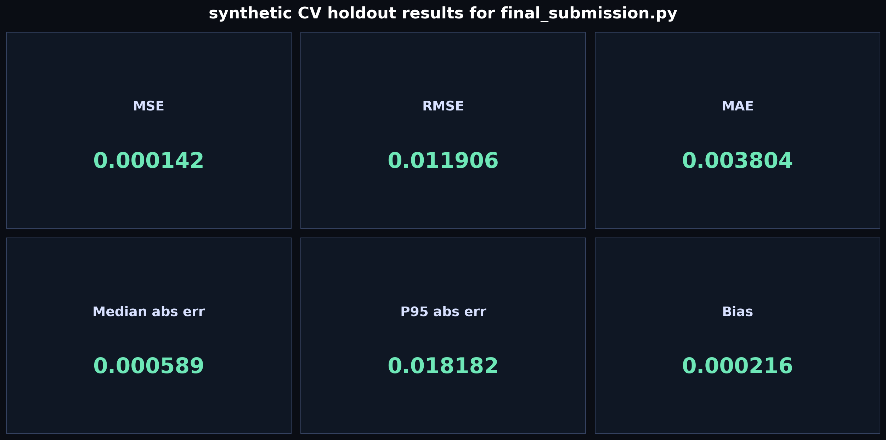
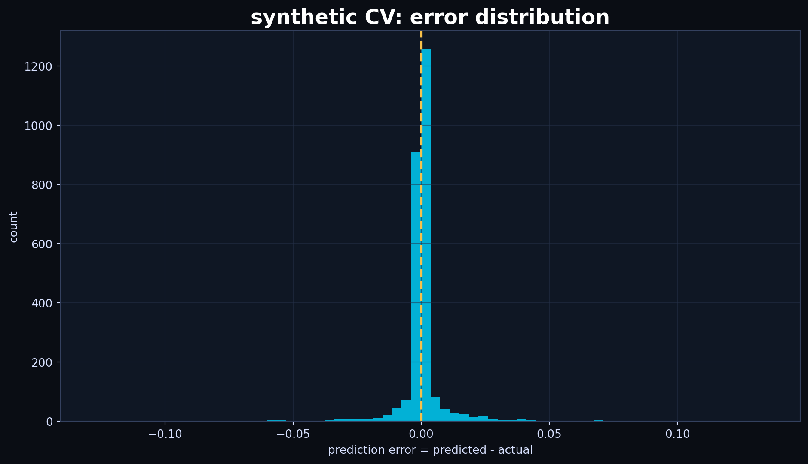
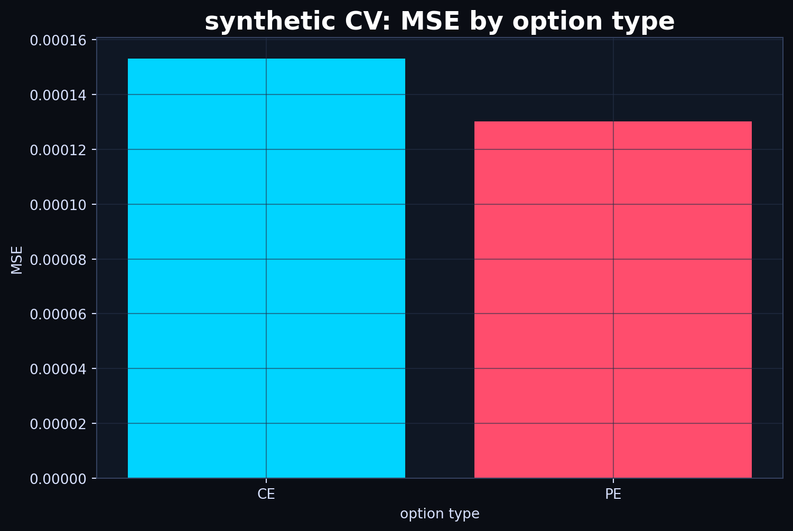
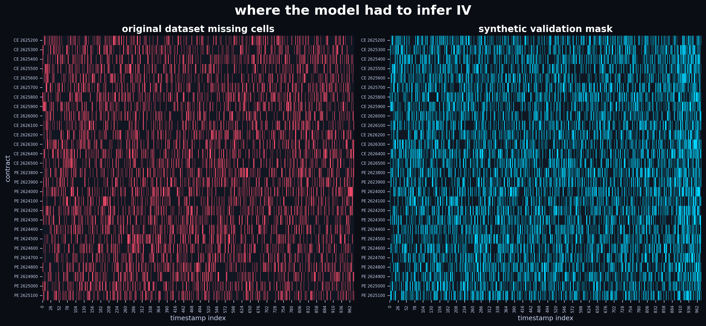

<style>
body {
  background: #0a0d14;
  color: #f3f7ff;
}
a {
  color: #00d4ff;
}
code, pre {
  background: #101722;
  color: #f8c14a;
}
</style>

# Final Submission: Implied Volatility Completion

This repository is meant to be read around one file:

```bash
final_submission.py
```

That is my final submission generator. It fills the missing implied volatility values and writes the file that should be submitted:

```text
submission_try_final_pchip_interior.csv
```

Run it from the repository root:

```bash
python final_submission.py --data everything_else/cv_validation_system/dataset.csv --skip-cv
```

It produces:

```text
filled_dataset_try_final_pchip_interior.csv
submission_try_final_pchip_interior.csv
diagnostics_try_final_pchip_interior.csv
cross_section_diagnostics_try_final_pchip_interior.csv
```

On the final full dataset run, it filled `5,460` missing IV cells and left `0` missing cells in the completed dataset.

## EDA: What The Given Dataset Shows

Before building the imputer, I first looked at the dataset as an option surface problem rather than as 28 unrelated columns. The given file has `975` timestamp rows, `28` option contracts, and `5,460` missing IV cells, which is exactly `20%` of the option grid.

The important EDA result is that the data is not one smooth regime. Most trading days from Jan 7 to Jan 23 have fairly low and stable observed IV. Their daily average IV stays roughly in the `0.12` to `0.16` range, and the cross-strike smile dispersion stays around `0.025` to `0.042`.

Jan 27 is different. It is the expiry-day regime. The daily average observed IV jumps to about `0.753`, and the cross-strike dispersion jumps to about `0.320`. That means the surface is no longer just shifting up and down; the smile itself is widening, steepening, and becoming more asymmetric near expiry.


The missing values also have structure. They are not just independent random holes. The heatmap below shows, for every timestamp and every contract, where IV was given and where it had to be inferred. The two lower panels compress the same idea across time: for each strike, they count how many timestamps were given and how many were missing.


This view is why I treated each timestamp as a cross-section. The data arrives as partial CE and PE smiles across strikes, repeated over time. The missingness is spread across the whole option chain, so the model has to reconstruct the smile shape at each timestamp instead of simply filling one isolated column.

The EDA scripts in `everything_else/eda/` helped make this clear:

```text
everything_else/eda/eda_lag1_calendar_gap/
everything_else/eda/eda_27jan_iv_3d_surface/
```

The lag-1 calendar-gap EDA showed that normal adjacent timestamps are usually highly correlated across option contracts. The median lag-1 cross-option correlation is about `0.995`. But the size of the IV move is very different on Jan 27: the mean absolute lag-1 IV change rises to about `0.055`, compared with roughly `0.002` to `0.006` on the earlier days.

That shaped the final modeling decision. I did not want a method that blindly assumes time smoothness across the whole month. Calendar time is useful for understanding the market path, but for filling a missing cell, the strongest information is usually the same-timestamp smile around that strike. Jan 27 is the proof: the surface changes too sharply for a global temporal smoother to be trusted everywhere.

## The Short Version

The solution treats every timestamp as an implied-volatility smile. Instead of predicting each option contract as an isolated time series, it asks:

> At this exact timestamp, what does the CE or PE smile look like across strikes, and where should the missing strike sit on that smile?

The model uses moneyness:

```text
x = K / S
```

where `K` is strike and `S` is the underlying price.

Then it splits missing cells into two very different problems:

```text
interior missing cell -> interpolate inside the observed smile
edge missing cell     -> extrapolate a smile wing carefully
```

Interior cells use local quadratic weighted least squares plus a conservative PCHIP shape-preserving interpolation blend.

Edge cells use a progressive local-polynomial ensemble, filling from the observed boundary outward.

That split is the main design decision.

## Final Filled IV Surfaces

These plots are generated from the final filled dataset. The surface is built with SciPy interpolation over `(days to expiry, strike)`, which gives a clean rectangular volatility surface and shows the curvature of the call and put smiles more clearly. The plotting scale clips only the most extreme IV values for visibility, so the surface shape is readable instead of being dominated by expiry-day spikes.

The small bright dots on the surfaces are the IV values that were already given in the original dataset. The smooth surface is the completed IV surface after the final filling method has inferred the missing cells around those observations.

Interactive Plotly versions are also generated:

```text
for_generating_readme/iv_surface_ce_3d.html
for_generating_readme/iv_surface_pe_3d.html
for_generating_readme/iv_surface_combined_3d.html
```


The late jump in both surfaces is the important visual feature: near expiry, IV moves sharply and the smile wings become much harder to extrapolate. This is why I did not settle for one global quadratic curve or a single smooth time model.

## What I Learned From The Attempts

I tried several families of models before choosing the final one. The useful lesson was not that one trick solved everything; it was that different missing-cell geometries needed different treatment.

The raw quadratic approach was simple: fit a quadratic smile and use it to fill gaps. It gave a clean first baseline, but the CV error was too high because quadratic extrapolation at the wings can become unstable.

The progressive quadratic edge versions improved that idea by filling edge blocks outward. That was the first big structural lesson: if the missing region is a block at the wing, the first missing value is much easier than the fifth missing value. Filling progressively gives the later values some local context.

The linear-edge experiments showed why degree selection matters. A line is sometimes safer than a quadratic at the edge because it has lower variance. But using only linear edge extrapolation throws away useful curvature when the nearby smile really is curved.

The local-polynomial edge experiments were stronger because they kept the fit local in moneyness and selected bandwidth by validation. They were better than global curve fitting, but the final model still improved by separating interior interpolation from edge extrapolation more explicitly.

The Jan 27 and temporal experiments were important because they showed the danger of over-specializing. Expiry day is visibly different, and time information can sometimes help, but it can also create large tail errors when the local smile shape changes abruptly. The final method stays mostly cross-sectional because the same-row smile is the most reliable source of information.

The CNN experiments were conceptually attractive because an IV smile is a 1D signal. But the dataset is small, the missing pattern is structured, and leakage/validation risk is high. A transparent cross-sectional method was easier to validate and debug.

The final model is basically the conclusion from all of that:

```text
use cross-sectional smile structure first
use local models, not global curves
interpolate interiors differently from edges
let LOO validation choose smoothing and degree
keep PCHIP as a conservative shape correction
avoid aggressive temporal corrections in the final submission
```

The synthetic CV comparison below shows why the final version was selected.


## Synthetic CV Validation

The repository includes a synthetic cross-validation system under:

```text
everything_else/cv_validation_system/
```

The idea is:

1. Start with the original dataset.
2. Hide some values that are actually observed.
3. Save those hidden true values separately.
4. Run the final submission generator on the damaged dataset.
5. Score only the hidden cells.

I ran:

```bash
python final_submission.py \
  --data everything_else/cv_validation_system/cv_split/not_dataset.csv \
  --out-prefix readme_cv_final \
  --skip-cv
```

Then I evaluated it with:

```bash
python everything_else/cv_validation_system/evaluate_cv_predictions_with_heatmaps.py \
  --truth everything_else/cv_validation_system/cv_split/holdout_truth.csv \
  --pred filled_dataset_readme_cv_final.csv \
  --base everything_else/cv_validation_system/cv_split/not_dataset.csv \
  --out-dir for_generating_readme/cv_eval_final_submission \
  --top-smile-plots 12 \
  --sample-smile-plots 8
```

Overall synthetic CV results:

```text
n hidden cells scored : 2621
MSE                   : 0.0001417534
RMSE                  : 0.0119060232
MAE                   : 0.0038038407
median absolute error : 0.0005887275
bias                  : 0.0002157616
p95 absolute error    : 0.0181816275
p99 absolute error    : 0.0615417097
```



The strongest errors are concentrated near the expiry-day regime. That matches the 3D surface: Jan 27 has much sharper IV movement and higher wing risk.

Regime-level CV result:

```text
pre-27 Jan MSE : 0.000008
Jan 27 MSE     : 0.000677
```

Option-type CV result:

```text
CE MSE : 0.000153
PE MSE : 0.000130
```

Important evaluator plots:







The evaluator also generates heatmaps. These are useful because they show whether errors are concentrated by time, moneyness, option type, or regime.


One of the top-error smile plots is shown below. The point of these plots is to inspect whether the model failed because the whole smile shifted, because one wing moved, or because the local observed context was thin.


## Missingness Pattern

The model is designed around the missingness geometry.



Interior missing cells are safer because the model can interpolate between observed strikes.

Edge missing cells are riskier because the model must infer a smile wing outside the observed support.

In the final full-data run:

```text
interior fills : 4491
edge fills     : 969
```


## Interior Logic In Detail

For a missing interior value, the model only uses the same row and the same option type.

For a missing CE cell, it uses CE observations from that timestamp.

For a missing PE cell, it uses PE observations from that timestamp.

The observed points are:

```text
(x_i, y_i)
```

where:

```text
x_i = K_i / S
y_i = observed IV at strike K_i
```

For target moneyness `x0`, the local quadratic model is:

```text
y_i ~= beta_0 + beta_1 (x_i - x0) + beta_2 (x_i - x0)^2
```

The prediction is `beta_0`, because at `x = x0`:

```text
x - x0 = 0
```

So:

```text
y_hat(x0) = beta_0
```

The model weights nearby strikes more:

```text
w_i = exp(-(x_i - x0)^2 / (2h))
```

Then it solves weighted least squares:

```text
min_beta sum_i w_i (y_i - X_i beta)^2
```

with the normal equation:

```text
(X' W X) beta = X' W y
```

The bandwidth `h` controls locality. A small `h` uses nearby strikes heavily. A larger `h` smooths over more of the smile.

The script chooses `h` by leave-one-out validation over:

```text
[5e-5, 7e-5, 1e-4, 1.5e-4, 2e-4]
```

For each candidate bandwidth, it hides every observed point once, predicts it, and computes:

```text
MSE(h) = mean((prediction_i_without_i - actual_i)^2)
```

Then:

```text
h* = argmin_h MSE(h)
```

After the local quadratic WLS estimate, the model tries PCHIP interpolation. PCHIP is a shape-preserving cubic interpolator. It is useful because it follows the observed smile without overshooting like a generic cubic spline can.

But it is only used when the target is truly inside the observed range. It is never used for extrapolation.

The final interior formula is:

```text
final = 0.75 * local_quadratic_wls + 0.25 * pchip
```

This is a conservative blend. WLS remains the anchor; PCHIP adjusts the shape.

The final full-data run used this interior PCHIP blend for all `4,491` non-edge fills.

## Edge Logic In Detail

Edges are different because there is no observed point on one side.

For example:

```text
observed observed observed missing_1 missing_2 missing_3
```

If we try to fill `missing_3` directly from observed points only, the model is extrapolating too far. The final code instead fills progressively:

```text
missing_1 -> fit from observed side
missing_2 -> fit from observed side + missing_1
missing_3 -> fit from observed side + missing_1 + missing_2
```

This is not pretending the previous predictions are true observations. It is a practical way to carry the wing shape outward instead of jumping too far in one step.

For each edge target, the model builds three related estimates:

```text
primary    : all observed points on the valid side, plus progressive context
corrected  : valid-side points with prior predictions placed at their actual moneyness
quadratic  : nearest valid-side neighborhood, limited to local wing context
```

Each estimate uses the same local-polynomial WLS engine. The difference is the training set.

For edges, the model does not fix the polynomial degree. It searches:

```text
degree in {1, 2}
bandwidth in [5e-5, 7e-5, 1e-4, 1.5e-4, 2e-4]
```

and chooses:

```text
(degree*, bandwidth*) = argmin LOO_MSE(degree, bandwidth)
```

The final edge prediction is:

```text
edge_prediction =
    0.72 * primary
  + 0.14 * corrected
  + 0.14 * quadratic
```

In the final full-data run:

```text
edge cells filled       : 969
degree 2 edge selections: 812
degree 1 edge selections: 157
global median fallback  : 0
```

That last line matters. The model completed every missing cell without needing a crude global-median fallback.

## Fitted Smile Examples

The yellow diamonds below are cells that were originally missing and were filled by the final model. I included timestamps from the start, middle, and expiry-day end of the sample because the regime change is visually obvious: early smiles are calm and low-IV, while Jan 27 smiles become steep, asymmetric, and much harder to extrapolate.


This plot is the intuition behind the approach. At a single timestamp, the nearby strike structure is strong. The model uses that structure first, instead of forcing every contract to be explained by a separate time-series rule.

## Function-Level Map

`parse_metadata` reads the option column names and extracts strike/type information.

`safe_iv` keeps outputs finite and positive.

`collect_same_row_points` gathers the observed same-row smile points.

`local_poly_wls_pred` is the core local regression engine.

`local_poly_wls_loo_preds`, `select_bandwidth_by_loo`, and `select_bandwidth_and_degree_by_loo` choose smoothing and edge degree by leave-one-out validation.

`pchip_same_row_pred` gives the interior shape-preserving interpolation estimate.

`get_same_side_state`, `get_edge_blocks`, and `is_edge_missing` decide whether a missing value is interior or edge.

`predict_non_edge_local_poly` performs:

```text
same-row observed points
-> LOO bandwidth selection
-> local quadratic WLS
-> PCHIP blend
```

`collect_edge_training_points_primary`, `collect_edge_training_points_corrected`, and `collect_edge_training_points_quadratic` build the three edge training views.

`_edge_predict_with_deg_select` performs edge degree/bandwidth selection and prediction.

`predict_edge_ensemble` combines the three edge estimates.

`predict_cell` routes every missing cell:

```text
if edge:
    use edge ensemble
else:
    use interior WLS + PCHIP
```

`build_missing_cell_fill_order` makes sure edge blocks are filled from the observed boundary outward.

`run_cv_validation` can do a lightweight random masking check inside the script.

`main` loads data, builds maps, fills all missing cells, and writes the final files.

## Rebuilding The README Figures

The README-specific EDA script is:

```bash
python for_generating_readme/generate_readme_eda.py
```

It reads the final filled dataset, the final diagnostics, the original dataset, and the synthetic CV files. It writes the README images and the interactive Plotly surfaces into:

```text
for_generating_readme/
```

The CV evaluator outputs used in this README are stored in:

```text
for_generating_readme/cv_eval_final_submission/
```

So the README is not a hand-wavy summary. It is tied to the actual generated final submission files and the synthetic CV run.
